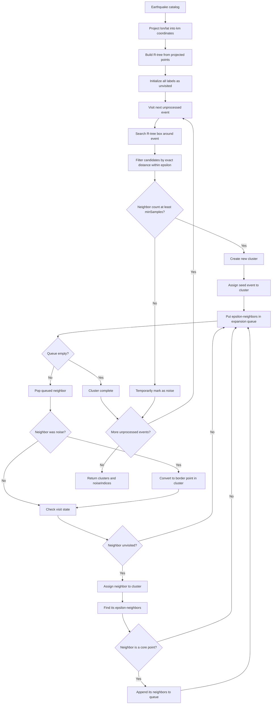
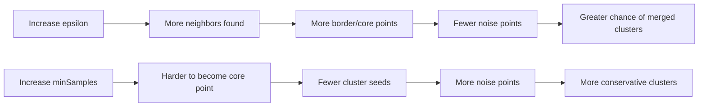

# DBSCAN Clustering in Temporal-Spatial Analysis

This document explains the DBSCAN option in the Temporal-Spatial Analysis module of ESNZ-ForecastApp.

## Where DBSCAN Is Used

The UI option is:

- `dbscan`: DBSCAN - Density-Based

The UI controls are in `src/components/tabs/TemporalSpatial.tsx`. The optimized DBSCAN implementation is in `src/lib/analysis/clustering.ts`.

## Parameters

- `epsilon`: spatial search radius in kilometers.
- `minSamples`: minimum number of events in the `epsilon` neighborhood required to make a core point.

Before DBSCAN runs, latitude and longitude are projected into approximate kilometer coordinates around the catalog mean:

```text
x = (longitude - meanLongitude) * 111.32 * cos(meanLatitude)
y = (latitude - meanLatitude) * 110.57
```

## Technical Meaning

DBSCAN builds clusters from density-connected points:

- A core point has at least `minSamples` points within `epsilon`.
- A border point does not have enough neighbors by itself, but is reachable from a core point.
- A noise point is not reachable from any core point.

The app uses an R-tree to avoid checking every event against every other event. The R-tree first returns bounding-box candidates, then the implementation filters those candidates by exact Euclidean distance in projected kilometers.



## Seismological Meaning

DBSCAN finds spatial concentrations of earthquakes at one selected length scale. In seismicity analysis, those concentrations may represent:

- aftershock zones,
- swarms,
- fault-zone activity,
- volcanic or geothermal seismicity,
- or persistent background seismicity concentrated in one region.

Because the current DBSCAN implementation is spatial only, it does not know whether the events occurred close together in time. A long-lived active region can therefore appear as a single cluster even if it is not one aftershock sequence.

## Noise Meaning

For DBSCAN, noise means:

```text
This event is not part of any density-connected spatial group under the current epsilon and minSamples settings.
```

Noise does not mean the event is invalid or non-seismic. It means the event is spatially isolated, or the nearby density is too low, at the current parameter scale.

## Parameter Effects

- Larger `epsilon`: fewer noise points, larger clusters, more risk of merging unrelated seismic zones.
- Smaller `epsilon`: more noise points, smaller clusters, more risk of splitting real sequences.
- Larger `minSamples`: stricter cluster definition, more noise.
- Smaller `minSamples`: easier clustering, less noise, more risk of weak or accidental clusters.



## Practical Use

Use DBSCAN when the question is:

```text
Which earthquakes form spatially dense groups at this distance scale?
```

Prefer ST-DBSCAN, STEP, TMC, or Hardebeck if the question requires time-dependent aftershock or swarm interpretation.
