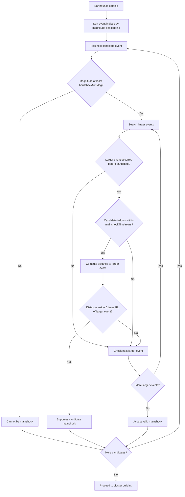
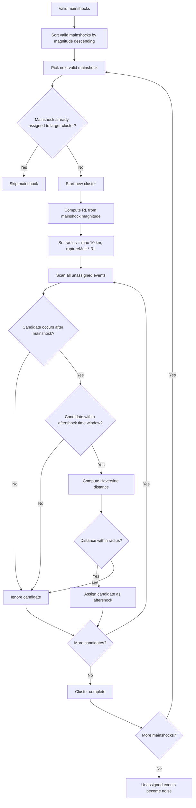
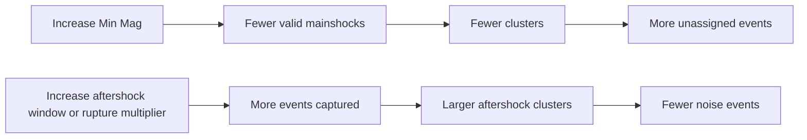

# Hardebeck 2019 Clustering in Temporal-Spatial Analysis

This document explains the Hardebeck 2019 option in the Temporal-Spatial Analysis module of ESNZ-ForecastApp.

## Where Hardebeck 2019 Is Used

The UI option is:

- `hardebeck-2019`: Hardebeck (2019)

The UI controls are in `src/components/tabs/TemporalSpatial.tsx`. The implementation is `hardebeckClustering` in `src/lib/analysis/clustering.ts`.

## Parameters

- `hardebeckMinMag`: minimum magnitude for candidate mainshocks.
- `hardebeckMainshockTimeYears`: time window used to suppress candidate mainshocks after larger nearby events.
- `hardebeckTimeWindow`: aftershock association window in days.
- `hardebeckRuptureMult`: multiplier applied to rupture length for aftershock radius.

Rupture length is calculated as:

```text
RL = 10^(-2.44 + 0.59 * M) km
```

The aftershock radius is:

```text
radius = max(10, hardebeckRuptureMult * RL) km
```

## Technical Meaning

Hardebeck clustering is a mainshock-aftershock windowing method. It first identifies valid mainshocks, then assigns later nearby events as aftershocks.

Candidate mainshocks are excluded if they occur after a larger event, within the selected mainshock exclusion time window, and within `5 * RL` of that larger event.



Cluster building:



## Seismological Meaning

Hardebeck 2019 is physically motivated around rupture length and mainshock-aftershock windows. It is useful for identifying short-term aftershock sequences around moderate-to-large mainshocks.

It differs from density clustering because it does not ask whether events are part of a dense cloud. It asks whether events fall inside a time-forward, rupture-scaled aftershock window of a valid mainshock.

## Noise Meaning

Noise means:

```text
The event was not accepted as a valid mainshock and was not assigned as an aftershock to a valid mainshock.
```

Noise can include real background events, events outside the selected time window, events outside the rupture-scaled radius, or candidate mainshocks suppressed by larger earlier events.

## Parameter Effects

- Larger `hardebeckMinMag`: fewer mainshocks, more noise.
- Larger `hardebeckTimeWindow`: longer aftershock capture window, less noise.
- Larger `hardebeckRuptureMult`: wider spatial capture region, less noise.
- Larger `hardebeckMainshockTimeYears`: stronger suppression of candidate mainshocks after larger events.



## Practical Use

Use Hardebeck 2019 when the question is:

```text
Which events fall inside rupture-scaled aftershock windows of valid mainshocks?
```

Use TMC when you need cluster merging and evolving time-magnitude interactions. Use STEP when you want STEP-style sliding windows.
