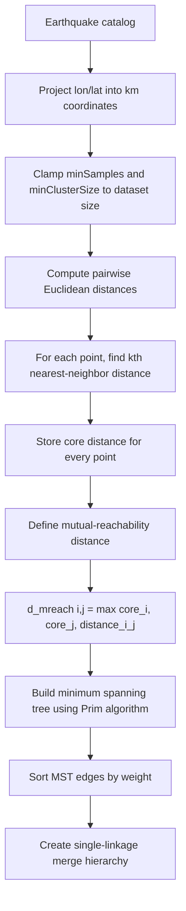
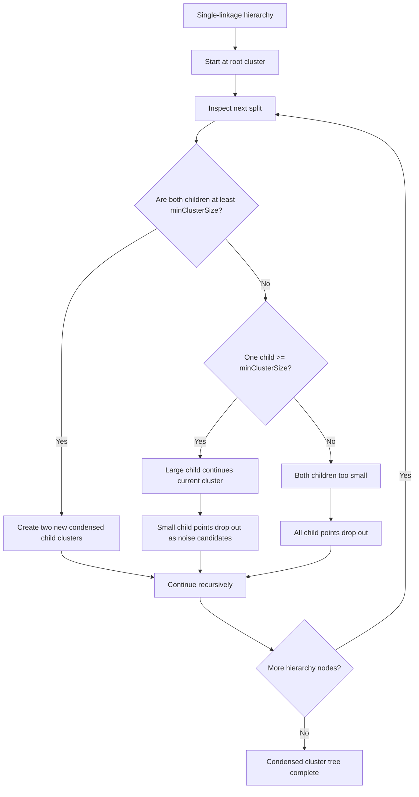
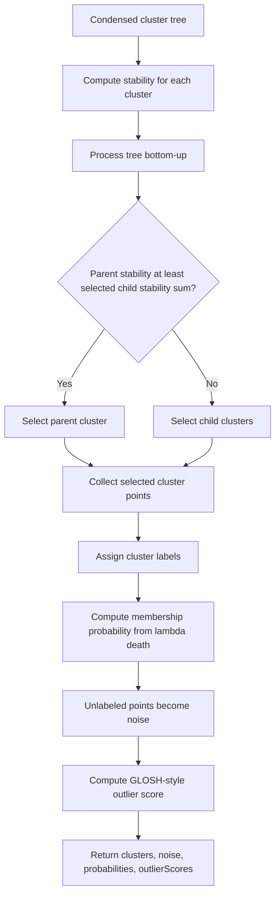
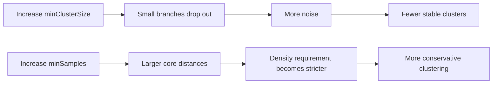

# HDBSCAN Clustering in Temporal-Spatial Analysis

This document explains the HDBSCAN option in the Temporal-Spatial Analysis module of ESNZ-ForecastApp.

## Where HDBSCAN Is Used

The UI option is:

- `hdbscan`: HDBSCAN - Hierarchical Density

The UI controls are in `src/components/tabs/TemporalSpatial.tsx`. The implementation is `hdbscanClustering` in `src/lib/analysis/clustering.ts`.

## Parameters

- `minClusterSize`: smallest group considered a genuine cluster.
- `minSamples`: k-nearest-neighbor size used to calculate core distance.

Coordinates are projected into approximate kilometers before clustering.

## Technical Meaning

HDBSCAN builds a hierarchy over density levels and selects the most stable clusters. Unlike DBSCAN, it does not require a single `epsilon` radius.

The implementation follows these phases:

1. Compute core distances.
2. Build a mutual-reachability graph.
3. Compute a minimum spanning tree.
4. Convert the tree into a single-linkage hierarchy.
5. Condense the hierarchy using `minClusterSize`.
6. Compute cluster stability.
7. Extract a flat clustering.
8. Assign probabilities and outlier scores.

## Detailed Algorithm Flow



Hierarchy condensation:



Cluster selection and labeling:



## Seismological Meaning

HDBSCAN is useful when earthquake densities vary strongly across the study region. Examples include:

- a dense aftershock core and diffuse outer aftershock halo,
- swarms with uneven internal density,
- mixed tectonic and volcanic seismicity,
- regional catalogs containing both active faults and sparse background events.

HDBSCAN is often a better choice than DBSCAN when no single `epsilon` value can describe all meaningful clusters.

## Noise Meaning

Noise means:

```text
The event did not belong to any selected stable density cluster.
```

The implementation also produces an outlier score:

```text
0 = nearly cluster-like
1 = strongly anomalous relative to the nearest condensed cluster
```

## Parameter Effects

- Larger `minClusterSize`: fewer, larger, more stable clusters; more noise.
- Smaller `minClusterSize`: more small clusters; less noise but more possible over-fragmentation.
- Larger `minSamples`: more conservative density estimate; more noise.
- Smaller `minSamples`: more permissive clustering.



## Practical Use

Use HDBSCAN when the question is:

```text
Which clusters are stable across density levels in a catalog with variable seismicity density?
```

Use DBSCAN when one distance scale is appropriate. Use ST-DBSCAN, STEP, TMC, or Hardebeck when time and sequence physics must be part of the cluster definition.
