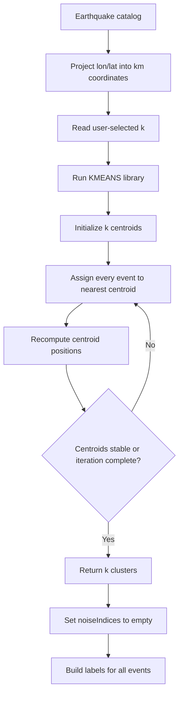
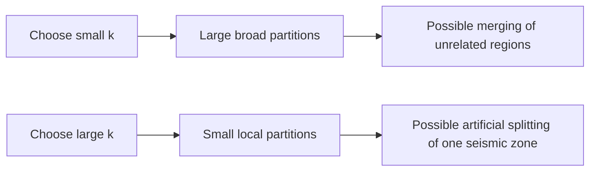

# K-Means Clustering in Temporal-Spatial Analysis

This document explains the K-Means option in the Temporal-Spatial Analysis module of ESNZ-ForecastApp.

## Where K-Means Is Used

The UI option is:

- `kmeans`: K-Means - Partition-based

The UI control is `Clusters (k)` in `src/components/tabs/TemporalSpatial.tsx`. The K-Means call is made in `src/lib/analysis/clustering.ts` using the `density-clustering` package.

## Parameters

- `k`: number of clusters to create.

Coordinates are projected into approximate kilometers before clustering:

```text
x = (longitude - meanLongitude) * 111.32 * cos(meanLatitude)
y = (latitude - meanLatitude) * 110.57
```

## Technical Meaning

K-Means partitions every event into one of `k` spatial groups. It minimizes within-cluster distance to cluster centroids.

Unlike DBSCAN, OPTICS, ST-DBSCAN, and HDBSCAN, K-Means does not have a concept of noise. Every earthquake is assigned to a cluster.



## Seismological Meaning

K-Means is a spatial partitioning tool, not a declustering tool. It is useful for:

- dividing the catalog into broad geographic regions,
- exploring rough spatial segmentation,
- comparing activity across a fixed number of zones.

It is not designed to identify aftershock sequences, swarms, or background seismicity. Since every event must belong to a cluster, K-Means can create clusters even where the seismicity is diffuse.

## Noise Meaning

K-Means produces no noise:

```text
noiseIndices = []
```

The Temporal-Spatial UI also re-enables `includeNoise` when switching to K-Means, because hiding noise has no useful meaning for this algorithm.

## Parameter Effects

- Larger `k`: more smaller regions, more spatial fragmentation.
- Smaller `k`: fewer larger regions, more merging of distinct seismic areas.



## Practical Use

Use K-Means when the question is:

```text
How can this catalog be divided into k spatial regions?
```

Do not use K-Means alone to infer background seismicity, aftershock sequences, or swarm membership.
