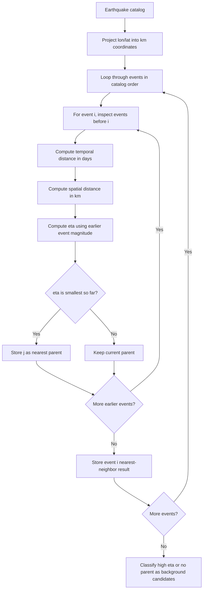
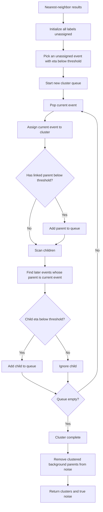
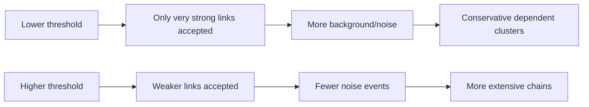

# Nearest-Neighbor Clustering in Temporal-Spatial Analysis

This document explains the Nearest-Neighbor option in the Temporal-Spatial Analysis module of ESNZ-ForecastApp.

## Where Nearest-Neighbor Is Used

The UI option is:

- `nearest-neighbor`: Nearest-Neighbor - Seismology

The UI control is `NN Threshold` in `src/components/tabs/TemporalSpatial.tsx`. The implementation is in `src/lib/analysis/clustering.ts`.

## Parameter

- `nnThreshold`: maximum nearest-neighbor metric value for dependent-event linkage.

Coordinates are projected into approximate kilometers before the metric is calculated.

## Technical Meaning

For each event, the implementation searches only earlier catalog events. It finds the earlier event with the smallest space-time-magnitude nearest-neighbor distance:

```text
eta = timeDays * spatialDistanceKm^1.6 / 10^(1.0 * earlierMagnitude)
```

An event with `eta < nnThreshold` is considered linked to its nearest earlier event. Linked parent-child relationships are then traversed to build clusters.



Cluster construction:



## Seismological Meaning

Nearest-Neighbor clustering is closer to declustering than pure spatial clustering. It asks whether each event is unusually close in space and time to an earlier event, with larger earlier events given stronger linking power.

This is useful for identifying:

- aftershock chains,
- foreshock-mainshock relationships,
- dependent event cascades,
- background events that do not link strongly to earlier seismicity.

## Noise Meaning

Noise means:

```text
The event remains background-like or independent after nearest-neighbor links are built.
```

Some events initially classified as background candidates can later become cluster members if they are the parent of dependent events. The implementation filters those out of `noiseIndices` after cluster construction.

## Parameter Effects

- Larger `nnThreshold`: more events link to earlier events, fewer noise points.
- Smaller `nnThreshold`: stricter dependent-event definition, more background/noise events.



## Practical Use

Use Nearest-Neighbor when the question is:

```text
Which events are dependent on earlier events in space-time-magnitude terms?
```

It is better suited than DBSCAN for background versus triggered-event interpretation.
