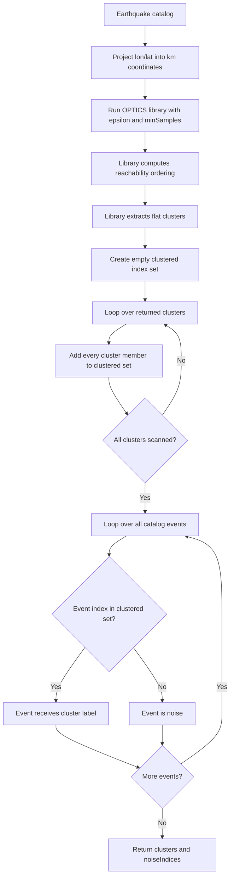
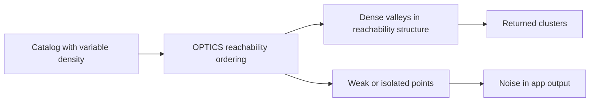

# OPTICS Clustering in Temporal-Spatial Analysis

This document explains the OPTICS option in the Temporal-Spatial Analysis module of ESNZ-ForecastApp.

## Where OPTICS Is Used

The UI option is:

- `optics`: OPTICS - Hierarchical Density

The UI controls are in `src/components/tabs/TemporalSpatial.tsx`. The OPTICS call is made in `src/lib/analysis/clustering.ts` using the `density-clustering` package.

## Parameters

- `epsilon`: maximum spatial search radius in kilometers.
- `minSamples`: minimum local neighborhood size used by the density method.

Coordinates are projected into approximate kilometers before clustering:

```text
x = (longitude - meanLongitude) * 111.32 * cos(meanLatitude)
y = (latitude - meanLatitude) * 110.57
```

## Technical Meaning

OPTICS is a density-based algorithm like DBSCAN, but it is designed to expose cluster structure across changing densities. Conceptually, it orders events by density reachability rather than committing only to one density level.

In this app, the library returns a flat list of clusters. The implementation then identifies noise by checking which event indices do not appear in any returned cluster.



## Seismological Meaning

OPTICS is useful when earthquake clustering density varies across the catalog. Examples include:

- a dense aftershock core with a diffuse outer sequence,
- swarms with uneven internal density,
- mixed urban/network-sensitive catalog regions,
- fault systems where some sections are much more active than others.

The current app output is still a flat cluster assignment, so the reachability structure is not visualized directly.

## Noise Meaning

For OPTICS, noise means:

```text
The event was not included in any cluster returned by the OPTICS library.
```

Seismologically, this usually corresponds to background or weakly connected seismicity at the selected density settings.

## Parameter Effects

- Larger `epsilon`: allows wider reachability searches and can reduce noise.
- Smaller `epsilon`: restricts searches and can split diffuse structures.
- Larger `minSamples`: requires stronger local density and produces more conservative clusters.
- Smaller `minSamples`: makes weaker density structures easier to cluster.



## Practical Use

Use OPTICS when the question is:

```text
Are there spatial clusters at different densities that DBSCAN may miss or merge?
```

Use HDBSCAN when you want a more explicit stability-based extraction of variable-density clusters.
