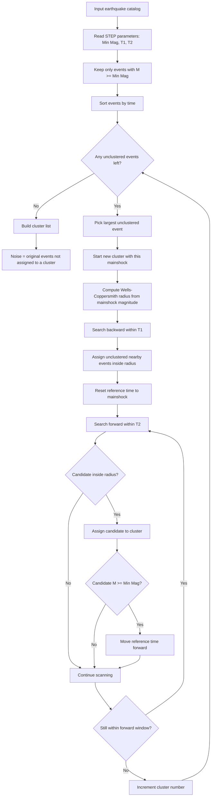
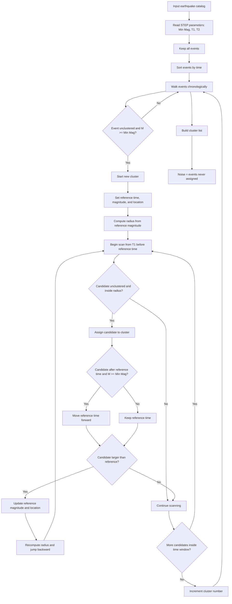
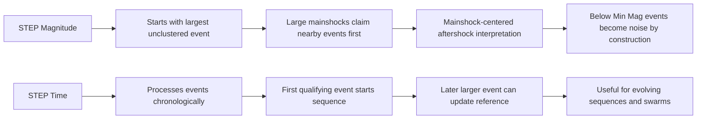

# STEP Clustering in Temporal-Spatial Analysis

This document explains how the STEP clustering options in the Temporal-Spatial Analysis module work in ESNZ-ForecastApp, and what their results mean seismologically.

## Where STEP Is Used

The Temporal-Spatial UI exposes two STEP algorithms:

- `step-mag`: STEP Magnitude - largest event first
- `step-time`: STEP Time - chronological sequence growth

The UI parameters are wired from `src/components/tabs/TemporalSpatial.tsx`, and the clustering logic is implemented in `src/lib/analysis/clustering.ts`.

## Parameters

Both STEP variants use the same three user-facing parameters:

- `Min Mag`: minimum magnitude allowed to start a STEP sequence.
- `T1`: backward search window in days.
- `T2`: forward search window in days.

The implementation converts `T1` and `T2` from days into decimal years for internal comparison.

Spatial association uses a magnitude-dependent search radius:

```text
radius = max(5, 10^(0.59 * M - 2.44)) km
```

Distances are calculated using the Haversine great-circle distance in kilometers.

## STEP Magnitude

STEP Magnitude is mainshock-dominant. It starts from the largest unclustered earthquake above `Min Mag`, treats that event as the mainshock, and then searches backward and forward in time for nearby events inside the magnitude-scaled radius.

Important behavior:

- Events below `Min Mag` are filtered out before clustering.
- The largest remaining unclustered event seeds the next cluster.
- The spatial radius is fixed from that mainshock magnitude.
- The backward window uses `T1`.
- The forward window uses `T2`.
- The forward window slides when qualifying events are absorbed.
- Events not assigned to any cluster, including below-threshold events, are reported as noise.



Seismological interpretation: STEP Magnitude is useful when the goal is to identify mainshock-centered aftershock sequences. Large events get priority, so they claim nearby events before smaller events can form separate clusters.

## STEP Time

STEP Time is sequence-evolution oriented. It processes events chronologically. The first unclustered event at or above `Min Mag` starts a new cluster, then the algorithm searches around it in a space-time window. If a larger event is found inside the sequence, the reference magnitude, location, and radius can update.

Important behavior:

- All catalog events are kept in the working set.
- Events below `Min Mag` cannot start clusters.
- Below-threshold events can still be absorbed into a cluster.
- The first unclustered event at or above `Min Mag` starts the next cluster.
- The search begins up to `T1` before the seed event.
- The search continues up to `T2` after the current reference time.
- A larger candidate can update the reference magnitude/location and cause the scan to jump backward.
- Events never assigned to a cluster are reported as noise.



Seismological interpretation: STEP Time is better suited to evolving sequences, cascading activity, and swarm-like behavior. Because processing follows catalog time, an earlier moderate event can seed a cluster before a later larger event appears. If that later event is larger and close enough, the sequence reference can expand around it.

## Side-by-Side Summary



## Noise Meaning in STEP

In both STEP variants, noise means an event was not assigned to any STEP cluster under the current parameter settings. It does not mean the event is invalid or non-seismic.

For STEP Magnitude, noise includes:

- Events below `Min Mag`.
- Events above `Min Mag` that were not captured by any mainshock-centered space-time window.

For STEP Time, noise includes:

- Events that never start a cluster.
- Events that are never absorbed into an existing chronological sequence.

Seismologically, noise is best interpreted as background or unclustered seismicity at the current STEP scale. Clustered events indicate earthquakes close enough in time and space, given the magnitude-dependent radius, to be treated as possible aftershock, foreshock, cascade, or swarm-related activity.

## Practical Interpretation

Use STEP Magnitude when the analysis question is:

```text
Which events belong to sequences centered on the largest local shocks?
```

Use STEP Time when the analysis question is:

```text
How do sequences develop through time, including cases where a later event becomes the largest event?
```

Parameter sensitivity matters. Increasing `T1`, `T2`, or the effective magnitude radius will usually reduce noise and merge more events into clusters. Raising `Min Mag` usually creates fewer seed events and can increase the number of events reported as noise, especially in STEP Magnitude.
