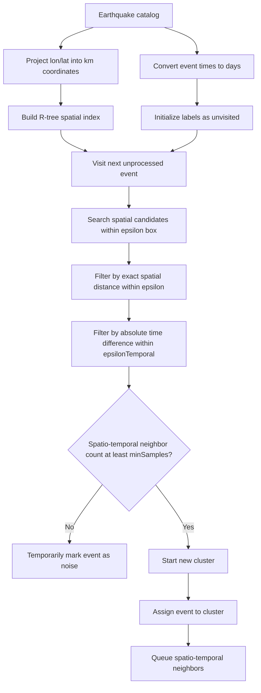
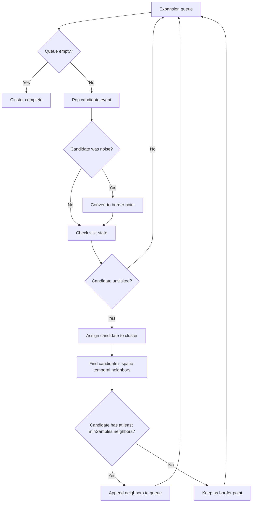
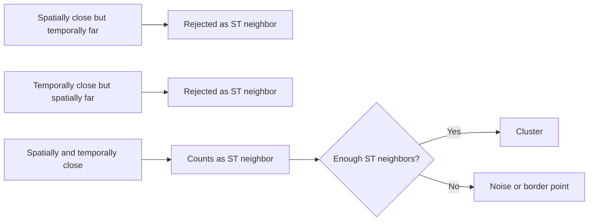

# ST-DBSCAN Clustering in Temporal-Spatial Analysis

This document explains the ST-DBSCAN option in the Temporal-Spatial Analysis module of ESNZ-ForecastApp.

## Where ST-DBSCAN Is Used

The UI option is:

- `st-dbscan`: ST-DBSCAN - Spatio-Temporal Density

The UI controls are in `src/components/tabs/TemporalSpatial.tsx`. The implementation is in `src/lib/analysis/clustering.ts`.

## Parameters

- `epsilon`: spatial search radius in kilometers.
- `epsilonTemporal`: temporal search radius in days.
- `minSamples`: minimum number of spatio-temporal neighbors needed to form a core point.

Coordinates are projected into approximate kilometers, and event times are converted into days.

## Technical Meaning

ST-DBSCAN extends DBSCAN by requiring events to be close in both space and time. A neighbor must satisfy:

```text
spatialDistance <= epsilon
absoluteTimeDifference <= epsilonTemporal
```

Only events passing both tests count toward `minSamples`.



Cluster expansion:



## Seismological Meaning

ST-DBSCAN is useful when spatial closeness alone is not enough. It targets events that form dense space-time bursts, such as:

- aftershock bursts,
- earthquake swarms,
- short-lived volcanic or geothermal activity,
- migrating or cascading seismic sequences.

Compared with spatial DBSCAN, ST-DBSCAN avoids grouping events that occur in the same place but years apart.

## Noise Meaning

Noise means:

```text
The event did not have enough neighbors close in both space and time.
```

An event can be spatially inside an active fault zone and still be ST-DBSCAN noise if it is temporally isolated.

## Parameter Effects

- Larger `epsilon`: allows wider spatial association.
- Larger `epsilonTemporal`: allows longer sequence duration.
- Larger `minSamples`: requires stronger local burst density.



## Practical Use

Use ST-DBSCAN when the question is:

```text
Which events form dense bursts in both space and time?
```

Use DBSCAN instead if you want long-term spatial seismicity patterns regardless of timing.
