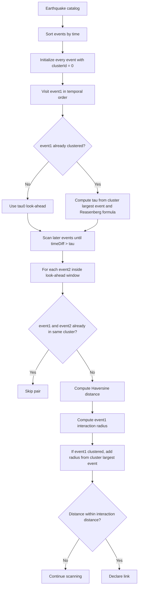
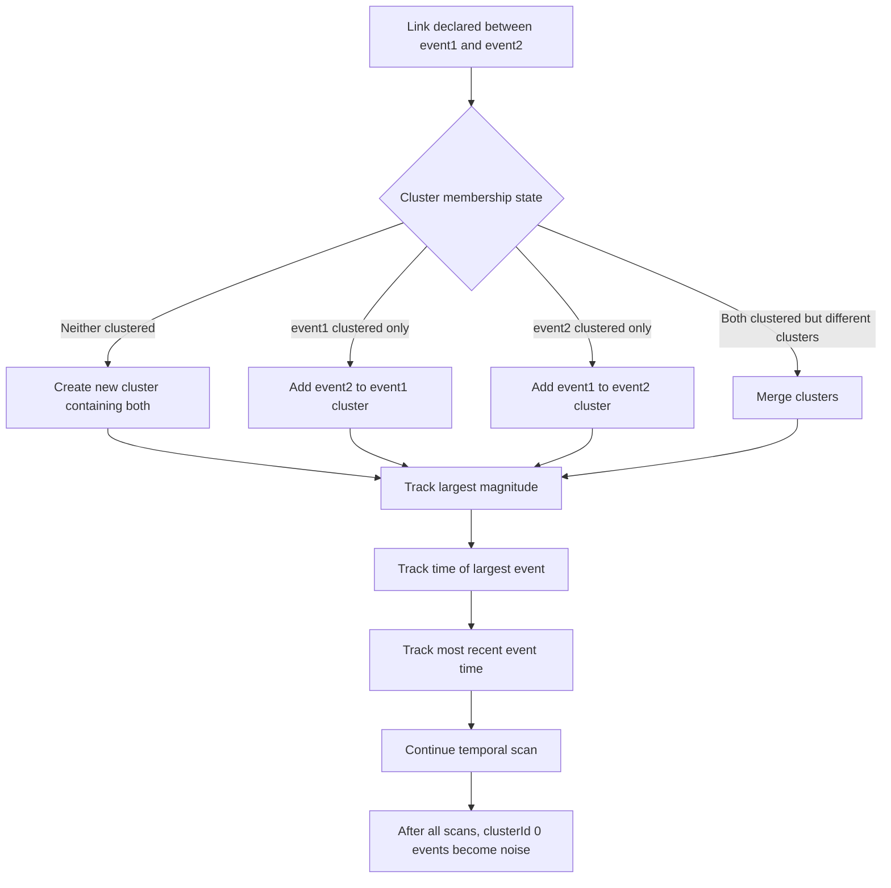
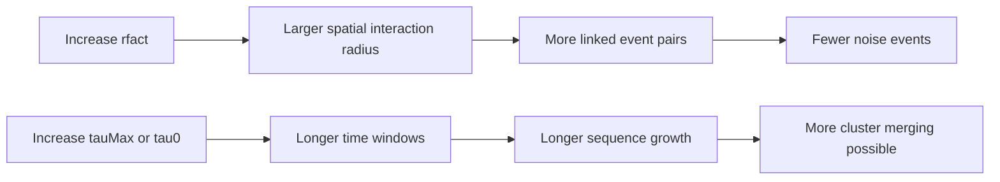

# TMC Reasenberg-Style Clustering in Temporal-Spatial Analysis

This document explains the TMC option in the Temporal-Spatial Analysis module of ESNZ-ForecastApp.

## Where TMC Is Used

The UI option is:

- `tmc`: TMC - Reasenberg Style

The UI controls are in `src/components/tabs/TemporalSpatial.tsx`. The implementation is `timeMagnitudeClustering` in `src/lib/analysis/clustering.ts`.

## Parameters

- `rfact`: multiplier for event interaction radius.
- `tau0`: base look-ahead time in days.
- `tauMax`: maximum look-ahead time in days.
- `p1`: probability threshold in the Reasenberg-style look-ahead formula.
- `xk`: magnitude scaling factor.
- `tmcMinMag`: internal effective minimum magnitude, defaulted in the clustering function.

Event interaction radius is:

```text
r = min(rfact * 0.011 * 10^(0.4 * M), 30) km
```

The cap at 30 km acts as a crustal-thickness-style constraint.

## Technical Meaning

TMC processes events in chronological order. For each event, it looks forward in time by a duration `tau`. If a later event is close enough in time and space, the two events are linked into a cluster.

For unclustered events, the look-ahead window is `tau0`. For clustered events, `tau` depends on elapsed time since the largest event in the cluster, then is clamped between `tau0` and `tauMax`.



Cluster update logic:



## Seismological Meaning

TMC is aimed at dependent-event clustering rather than generic spatial grouping. It is appropriate for declustering-style questions such as:

- which events are linked as aftershocks,
- which events belong to cascading sequences,
- which events remain independent background candidates.

The important feature is that cluster growth depends on both time and magnitude. Larger events increase the effective interaction scale and influence the future look-ahead behavior.

## Noise Meaning

Noise means:

```text
The event was never linked to another event by the Reasenberg-style space-time interaction rules.
```

Noise events are candidates for background or independent seismicity under the chosen TMC parameters.

## Parameter Effects

- Larger `rfact`: larger interaction radius, more clustering.
- Larger `tau0`: longer base look-ahead, more early links.
- Larger `tauMax`: allows longer-lived clusters.
- Larger `p1`: can increase the Reasenberg-style look-ahead time.
- Larger `xk`: changes the magnitude scaling in the tau formula.



## Practical Use

Use TMC when the question is:

```text
Which events are dependent on prior seismicity under Reasenberg-style space-time rules?
```

Use Hardebeck if you want simpler rupture-length mainshock windows. Use ST-DBSCAN if you want density-based bursts without Reasenberg-style magnitude interaction.
