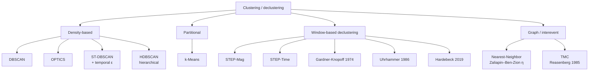

# Clustering Algorithms

Twelve spatial, spatio-temporal, and window-based declustering algorithms are implemented. Eight run in a Web Worker (light); four heavy $\mathcal{O}(n^2)$ algorithms are routed to the server API.

> For an algorithm-by-algorithm deep dive of the **declustering** methods (Gardner-Knopoff, Uhrhammer, Hardebeck, STEP, Reasenberg/TMC, Nearest-Neighbor) — each with a step-by-step Mermaid diagram — see [Declustering Methods](declustering-methods.md).

---

## Algorithm family



---

## Routing decision

```typescript
// src/hooks/useClusteringWorker.ts
const HEAVY_ALGORITHMS = new Set(['hdbscan', 'nearest-neighbor', 'tmc', 'hardebeck-2019']);

if (HEAVY_ALGORITHMS.has(algorithm)) {
    // POST /api/cluster  (server-side, always, LRU cached)
} else {
    // postMessage → clustering.worker.ts  (Web Worker, 30s timeout)
    // dbscan, optics, kmeans, st-dbscan, step-mag, step-time, gardner-knopoff, uhrhammer
}
```

---

## Coordinate system

### Equirectangular projection

All distance-based algorithms project geographic coordinates to a flat kilometre plane centred on the mean coordinates $(\bar{\phi}, \bar{\lambda})$ of the dataset:

$$x = (\lambda - \bar{\lambda}) \times 111.32 \times \cos\!\left(\bar{\phi}\,\frac{\pi}{180}\right) \quad [\text{km}]$$

$$y = (\phi - \bar{\phi}) \times 110.57 \quad [\text{km}]$$

Used by the pure density/partitional algorithms (DBSCAN, OPTICS, k-Means).

### Haversine great-circle distance

Used for exact distances in **ST-DBSCAN, HDBSCAN, STEP, TMC, Hardebeck, Gardner-Knopoff, and Uhrhammer** (matching the `esnz_aftershocks` reference, which uses `BallTree`/`HDBSCAN` with `metric='haversine'`):

$$\Delta\phi = (\phi_2 - \phi_1)\frac{\pi}{180}, \qquad \Delta\lambda = (\lambda_2 - \lambda_1)\frac{\pi}{180}$$

$$a = \sin^2\!\frac{\Delta\phi}{2} + \cos\phi_1 \cos\phi_2 \sin^2\!\frac{\Delta\lambda}{2}$$

$$d = 2R\arctan2\!\left(\sqrt{a},\,\sqrt{1-a}\right), \qquad R = 6{,}371\ \text{km}$$

### Wells-Coppersmith rupture length

Used by STEP, TMC, and Hardebeck to scale spatial windows to earthquake size:

$$\mathrm{RL}(M) = 10^{-2.44 + 0.59M} \quad [\text{km}]$$

---

## Algorithm summary

| Algorithm | Worker/Server | Key parameters | Noise label |
|---|---|---|---|
| DBSCAN | Worker | $\varepsilon$ (km), `minSamples` | $-1$ |
| OPTICS | Worker | $\varepsilon$ (km), `minSamples` | $-1$ |
| k-Means | Worker | $k$ | none |
| ST-DBSCAN | Worker | $\varepsilon$, $\varepsilon_t$ (days), `minSamples` | $-1$ |
| STEP-Mag | Worker | $M_{\min}$, $T_1$, $T_2$ | $-1$ |
| STEP-Time | Worker | $M_{\min}$, $T_1$, $T_2$ | $-1$ |
| Gardner-Knopoff | Worker | `gkSpatialA/B`, `gkTemporalC/D`, `gkPiecewiseTemporal` | $-1$ |
| Uhrhammer | Worker | `uhrSpatialA/B`, `uhrTemporalA/B`, `uhrFsTimeProp` | $-1$ |
| HDBSCAN | Server | `minClusterSize`, `minSamples` | $-1$ |
| Nearest-Neighbor | Server | $\eta_{\text{threshold}}$ (or Otsu auto) | $-1$ |
| TMC | Server | $r_{\text{fact}}$, $\tau_0$, $\tau_{\max}$, $p_1$, $x_k$, $M_{\min}$ | $-1$ |
| Hardebeck-2019 | Server | $M_{\min}$, $T_w$, $r_{\text{mult}}$, $T_{\text{excl}}$ | $-1$ |

---

## DBSCAN

Groups points reachable within $\varepsilon$ km with at least `minSamples` neighbours. Unreachable points are labelled $-1$ (noise).

**R-tree optimisation (`useRTree: true`, default):** Range queries use a **RBush** spatial index, reducing complexity from $\mathcal{O}(n^2)$ to $\mathcal{O}(n \log n)$. See [Performance](performance.md#5-r-tree-spatial-indexing) for details.

| Key | Default | Description |
|---|---|---|
| `epsilon` | 25 km | Core-point neighbourhood radius $\varepsilon$ |
| `minSamples` | 5 | Minimum points to form a core point |
| `useRTree` | `true` | Enable R-tree acceleration |

---

## OPTICS

Extends DBSCAN to produce a reachability plot for variable-density cluster extraction. Implemented via the `density-clustering` library.

**Parameters:** identical to DBSCAN.

---

## k-Means

Partitions events into exactly $k$ clusters by minimising within-cluster variance. No noise points.

| Key | Default | Description |
|---|---|---|
| `k` | 5 | Number of clusters |

---

## ST-DBSCAN

Extends DBSCAN with a temporal epsilon $\varepsilon_t$. Two events are neighbours only if they satisfy both:

$$d_{\text{spatial}}(i, j) \leq \varepsilon \quad \text{and} \quad |t_i - t_j| \leq \varepsilon_t$$

Event timestamps are converted to fractional days from epoch for the temporal comparison. The spatial test uses the **haversine** great-circle distance (the R-tree provides candidate pre-filtering in projected km, then the exact great-circle distance is checked) to match the `esnz_aftershocks` `BallTree(metric='haversine')` reference.

| Key | Default | Description |
|---|---|---|
| `epsilon` | 25 km | Spatial neighbourhood radius $\varepsilon$ |
| `epsilonTemporal` | 14 days | Temporal neighbourhood window $\varepsilon_t$ |
| `minSamples` | 5 | Minimum neighbours (both conditions must hold) |

---

## STEP-Mag

Events are associated to mainshock clusters based on magnitude-scaled look-back and look-forward windows. Events are processed largest-magnitude first.

**Spatial window** uses the Wells-Coppersmith rupture length:

$$\mathrm{RL}(M) = 10^{-2.44 + 0.59M} \quad [\text{km}]$$

Only events with magnitude strictly above $M_{\min}$ can seed or extend a cluster.

| Key | Default | Description |
|---|---|---|
| `stepMinMag` | 2.0 | Minimum mainshock magnitude $M_{\min}$ |
| `stepT1` | 1 day | Look-back window $T_1$ |
| `stepT2` | 30 days | Look-forward window $T_2$ |

---

## STEP-Time

Identical to STEP-Mag but events are processed in **temporal order**. The cluster reference location and radius update when a larger event is found within it.

**Parameters:** same as STEP-Mag.

---

## HDBSCAN — *server only*

Campello et al. (2013). Builds a hierarchy of DBSCAN clusterings across all density thresholds and extracts the most stable clusters via the *Excess of Mass* criterion.

### Phase 1 — Core distances

For each point $i$, compute its core distance: the Euclidean distance to its $k$-th nearest neighbour, denoted $\text{core}_k(i)$.

### Phase 2 — Mutual-reachability graph and MST

Define the mutual-reachability distance:

$$d_{\text{mreach}}(i,j) = \max\!\bigl(\text{core}_k(i),\;\text{core}_k(j),\;d_{\text{eucl}}(i,j)\bigr)$$

Build a minimum spanning tree (MST) on the complete graph weighted by $d_{\text{mreach}}$ using **Prim's algorithm**.

### Phase 3 — Single-linkage dendrogram

Sort MST edges by weight and merge components in ascending order to produce a full dendrogram.

### Phase 4 — Condense tree

Walk the dendrogram bottom-up. At each split, if one side has fewer than `minClusterSize` points, those points *fall out* (their death level $\lambda_{\text{death}}$ is recorded, where $\lambda = 1/d$). Otherwise a new sub-cluster is created.

### Phase 5 — Cluster stability (Excess of Mass)

$$\text{stability}(C) = \sum_{p \in C} \bigl(\lambda_{\text{death}}(p) - \lambda_{\text{birth}}(C)\bigr)$$

### Phase 6 — Cluster selection (bottom-up DP)

For each cluster, keep it if its own stability exceeds the sum of its children's stabilities:

$$\text{keep } C \iff \text{stability}(C) \geq \sum_{\text{child}} \text{stability}(\text{child})$$

### Phase 7 — Membership probabilities and GLOSH outlier scores

$$\text{prob}(p) = \frac{\lambda_{\text{death}}(p)}{\lambda_{\max}(\text{assigned cluster})}$$

$$\text{outlier}(p) = 1 - \frac{\lambda_{\text{death}}(p)}{\lambda_{\max}(\text{drop cluster})}$$

Higher outlier score indicates a more anomalous event.

| Key | Default | Description |
|---|---|---|
| `hdbscanMinClusterSize` | 5 | Smallest grouping considered a true cluster |
| `hdbscanMinSamples` | 5 | $k$-NN neighbourhood size for core-distance computation |

**Extra `ClusterResult` fields:** `probabilities[]`, `outlierScores[]`

---

## Nearest-Neighbor (Zaliapin–Ben-Zion) — *server only*

Zaliapin & Ben-Zion (2013). Computes normalised interevent distances in joint space–time–magnitude space:

$$\eta(i,j) = \frac{t_{ij} \cdot r_{ij}^{d}}{10^{b\, m_i}}$$

| Symbol | Value | Meaning |
|---|---|---|
| $t_{ij}$ | — | Time difference in days (only earlier events considered as parents) |
| $r_{ij}$ | — | Spatial distance in km |
| $d$ | 1.6 | Fractal dimension constant |
| $b$ | 1.0 | Gutenberg-Richter b-value constant |
| $m_i$ | — | Magnitude of the candidate parent event |

Events are processed in **chronological order**, and each event is linked to the earlier event (strictly $\Delta t > 0$, enforcing causality) that minimises $\eta$. Thresholding is performed in **$\log_{10}\eta$ space**, where the clustered and background populations form a bimodal distribution:

- **`nnThreshold > 0`** (default `1.0`): the separating threshold is **auto-inferred** from the $\log_{10}\eta$ histogram via **Otsu between-class-variance maximization** (`inferLog10EtaThreshold`, mirroring the `clusterPipeline` `infer_eta_threshold`), with a low-quantile fallback when there are too few links to histogram.
- **`nnThreshold ≤ 0`**: the value is used **directly** as the explicit $\log_{10}\eta$ cutoff.

A link is *triggered* when $\log_{10}\eta \le$ threshold. Clusters are formed by following triggered parent links to a root; events with no triggered links (singletons) are labelled noise ($-1$).

| Key | Default | Description |
|---|---|---|
| `nnThreshold` | 1.0 | $> 0$ → Otsu auto-threshold on $\log_{10}\eta$; $\le 0$ → explicit $\log_{10}\eta$ cutoff |

---

## TMC (Time-Magnitude Clustering — Reasenberg-style) — *server only*

A probabilistic look-ahead approach inspired by Reasenberg (1985).

**Interaction radius** (capped at 30 km):

$$r(M) = r_{\text{fact}} \times 0.011 \times 10^{0.4M}, \qquad r \leq 30\ \text{km}$$

**Reasenberg look-ahead time:**

$$\Delta M = \max\!\bigl(0,\;(1 - x_k)\,M_{\max} - M_{\min}\bigr)$$

$$\tau = \frac{-\ln(1 - p_1)\,t}{10^{(\Delta M - 1)\,2/3}}, \qquad \tau = \max\!\bigl(\tau_{\min},\,\min(\tau, \tau_{\max})\bigr)$$

where $t$ is time elapsed since the largest event in the cluster, $M_{\max}$ is the magnitude of the largest event, and $M_{\min}$ is `tmcMinMag`. $\Delta M$ is **floored at 0** (per the `bruces`/ZMAP and `esnz` `decluster_reasenberg` references) — a negative $\Delta M$ would shrink the denominator below 1 and inflate $\tau$ unboundedly. An *unclustered* event uses $\tau = \tau_0$; a *clustered* event is clamped to $[\tau_{\min}, \tau_{\max}]$. The interaction radius is the sum $r_1 + r_{\text{main}}$ capped at 30 km (the cap applies to the **sum**, matching `cluster2000x.f`), where $r_{\text{main}}$ does **not** scale by $r_{\text{fact}}$.

Events are processed chronologically. Two events bridge separate clusters: clusters are merged.

| Key | Default | Description |
|---|---|---|
| `tmcRfact` | 10 | Spatial radius multiplier $r_{\text{fact}}$ |
| `tmcTau0` | 2 days | Look-ahead for an unclustered event $\tau_0$ |
| $\tau_{\min}$ | 1 day | Lower clamp for a clustered event (fixed internal default, not an exposed option) |
| `tmcTauMax` | 10 days | Maximum look-ahead time $\tau_{\max}$ |
| `tmcP1` | 0.99 | Interaction probability threshold $p_1$ |
| `tmcXk` | 0.5 | Magnitude scaling factor $x_k$ |
| `tmcMinMag` | 1.5 | Effective minimum seed magnitude $M_{\min}$ |

---

## Hardebeck-2019 — *server only*

Hardebeck (2019) updated window method based on Wells-Coppersmith (1994) rupture lengths.

**Rupture length** (Wells-Coppersmith 1994):

$$\mathrm{RL}(M) = 10^{-2.44 + 0.59M} \quad [\text{km}]$$

**Algorithm** (largest mainshocks processed first):

1. Skip any candidate mainshock that falls within $T_{\text{excl}}$ years and $5 \times \mathrm{RL}$ of a larger event — it is itself an aftershock
2. Tag all events within $T_w$ days and $r_{\text{mult}} \times \mathrm{RL}$ km as aftershocks of the mainshock

| Key | Default | Description |
|---|---|---|
| `hardebeckMinMag` | 5.0 | Minimum mainshock magnitude |
| `hardebeckTimeWindow` | 10 days | Aftershock collection window $T_w$ |
| `hardebeckRuptureMult` | 3 | Spatial radius multiplier $r_{\text{mult}}$ |
| `hardebeckMainshockTimeYears` | 3 years | Mainshock exclusion look-back $T_{\text{excl}}$ |

---

## Gardner-Knopoff (1974)

Classic magnitude-window declustering. Faithful to the `esnz_aftershocks` `decluster_gardner_knopoff`. Each event defines a spatial window $W_s$ and temporal window $W_t$; smaller events falling within **both** windows of a larger event (looking forward by $W_t$ and back by `gkFsTimeProp` $\times W_t$) are flagged dependent. Distances are haversine.

**Spatial window:**

$$W_s(M) = 10^{\,a M + b} \quad [\text{km}], \qquad a = 0.1238,\; b = 0.983$$

**Temporal window** (piecewise, the published Gardner-Knopoff form, `gkPiecewiseTemporal = true`):

$$W_t(M) = \begin{cases} 10^{\,0.032 M + 2.7389} & M \ge 6.5 \\[4pt] 10^{\,0.5409 M - 0.547} & M < 6.5 \end{cases} \quad [\text{days}]$$

Applying the large-magnitude branch to $M < 6.5$ grossly over-windows (e.g. M5 → ~707 d instead of the correct ~84 d), so the breakpoint is honoured. Setting `gkPiecewiseTemporal = false` uses the single $10^{cM+d}$ form for all magnitudes.

| Key | Default | Description |
|---|---|---|
| `gkSpatialA` | 0.1238 | Spatial window exponent slope $a$ |
| `gkSpatialB` | 0.983 | Spatial window exponent intercept $b$ |
| `gkTemporalC` | 0.032 | Temporal exponent slope $c$ (M ≥ 6.5 branch / non-piecewise) |
| `gkTemporalD` | 2.7389 | Temporal exponent intercept $d$ |
| `gkPiecewiseTemporal` | `true` | Use the published M ≥ 6.5 piecewise temporal window |

---

## Uhrhammer (1986)

Same window-declustering core as Gardner-Knopoff but with Uhrhammer's exponential window definitions — generally **more conservative (shorter)** windows. Faithful to the `esnz_aftershocks` `decluster_uhrhammer`.

**Spatial window:**

$$W_s(M) = \exp(a + b M) \quad [\text{km}], \qquad a = -1.024,\; b = 0.804$$

**Temporal window:**

$$W_t(M) = \exp(a + b M) \quad [\text{days}], \qquad a = -2.870,\; b = 1.235$$

| Key | Default | Description |
|---|---|---|
| `uhrSpatialA` | −1.024 | Spatial window $\exp(a + bM)$: $a$ |
| `uhrSpatialB` | 0.804 | Spatial window $\exp(a + bM)$: $b$ |
| `uhrTemporalA` | −2.870 | Temporal window $\exp(a + bM)$: $a$ |
| `uhrTemporalB` | 1.235 | Temporal window $\exp(a + bM)$: $b$ |
| `uhrFsTimeProp` | 1.0 | Foreshock (look-back) window as a fraction of $W_t(M)$, in $[0, 1]$ |

---

## Client-side result cache

Clustering results are cached in `src/lib/analysis/clusteringCache.ts` (separate from the server LRU):

| Property | Value |
|---|---|
| Max entries | 10 |
| TTL | 5 minutes |
| Key | `dataHash : JSON.stringify(options)` |
| Data hash | $\mathcal{O}(1)$ sample — array length + first/last/middle `timeMs` + sample magnitudes |

---

## Full parameter reference

```typescript
interface SpatialClusteringOptions {
    algorithm: ClusteringAlgorithm;   // required

    epsilon?: number;           // km  — DBSCAN / OPTICS / ST-DBSCAN  (default 25)
    minSamples?: number;        // DBSCAN / OPTICS / HDBSCAN           (default 5)
    k?: number;                 // k-Means cluster count               (default 5)
    useRTree?: boolean;         // R-tree acceleration                 (default true)
    nnThreshold?: number;       // Nearest-Neighbor: >0 Otsu auto, ≤0 explicit log10η (default 1.0)
    epsilonTemporal?: number;   // days — ST-DBSCAN                    (default 14)

    stepMinMag?: number;        // STEP min mainshock magnitude        (default 2.0)
    stepT1?: number;            // STEP look-back days                 (default 1)
    stepT2?: number;            // STEP look-forward days              (default 30)

    tmcRfact?: number;          // TMC radius multiplier               (default 10)
    tmcTau0?: number;           // TMC min look-ahead days             (default 2)
    tmcTauMax?: number;         // TMC max look-ahead days             (default 10)
    tmcP1?: number;             // TMC probability threshold           (default 0.99)
    tmcXk?: number;             // TMC magnitude scaling               (default 0.5)
    tmcMinMag?: number;         // TMC min seed magnitude              (default 1.5)

    hardebeckMinMag?: number;             // default 5.0
    hardebeckTimeWindow?: number;         // days, default 10
    hardebeckRuptureMult?: number;        // default 3
    hardebeckMainshockTimeYears?: number; // default 3

    hdbscanMinClusterSize?: number;       // default 5
    hdbscanMinSamples?: number;           // default 5

    gkSpatialA?: number;        // Gardner-Knopoff spatial 10^(aM+b): a (default 0.1238)
    gkSpatialB?: number;        //                                    b (default 0.983)
    gkTemporalC?: number;       // Gardner-Knopoff temporal 10^(cM+d): c (default 0.032)
    gkTemporalD?: number;       //                                    d (default 2.7389)
    gkPiecewiseTemporal?: boolean; // use published M≥6.5 piecewise window (default true)

    uhrSpatialA?: number;       // Uhrhammer spatial exp(a+bM): a (default -1.024)
    uhrSpatialB?: number;       //                             b (default 0.804)
    uhrTemporalA?: number;      // Uhrhammer temporal exp(a+bM): a (default -2.870)
    uhrTemporalB?: number;      //                              b (default 1.235)
    uhrFsTimeProp?: number;     // foreshock window fraction of T(M), [0,1] (default 1.0)
}
```

---

## Selection modes in Temporal-Spatial tab

After clustering, two selection modes are available:

| Mode | Behaviour |
|---|---|
| `individual` | Click a point to toggle it; noise points ($-1$) always use this mode |
| `cluster` | Click any point to select all events with the same cluster label |

A **"Show only this cluster"** toggle isolates one cluster across all three linked views (Leaflet map, temporal scatter, 3D plot).

---

## Per-algorithm deep dives

The **density / partition** algorithms each have a dedicated page with a step-by-step Mermaid diagram below. The **declustering** algorithms (Gardner-Knopoff, Uhrhammer, Hardebeck, STEP, Reasenberg/TMC, Nearest-Neighbor) live under [Declustering Methods](declustering-methods.md).

```{toctree}
:maxdepth: 1

clustering/dbscan
clustering/optics
clustering/kmeans
clustering/st-dbscan
clustering/hdbscan
```
