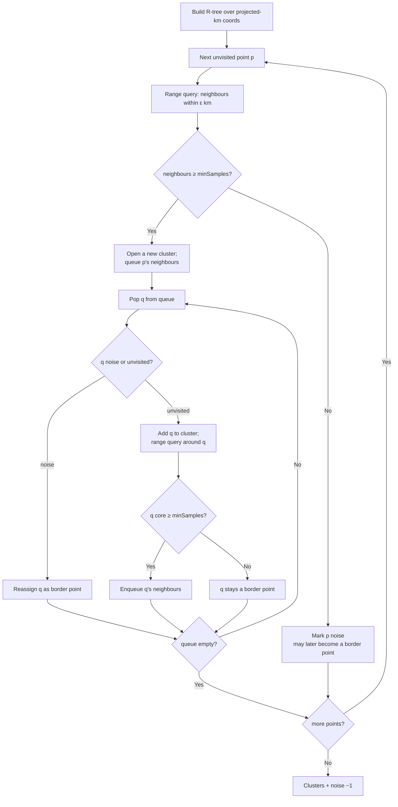

# DBSCAN

> Part of [Clustering Algorithms](../clustering-algorithms.md). Algorithm: `dbscan` (Worker-routed).

Density-Based Spatial Clustering of Applications with Noise. Groups points that are densely packed and labels points in low-density regions as **noise** ($-1$). Distances use the equirectangular projected-km plane; an **R-tree (RBush)** spatial index accelerates the range queries from $\mathcal{O}(n^2)$ to $\mathcal{O}(n\log n)$.

## Definitions

For a radius $\varepsilon$ and minimum count `minSamples`:

- a point $p$ is a **core point** if $|\{q : d(p,q)\le\varepsilon\}|\ge$ `minSamples`;
- $q$ is **directly density-reachable** from a core $p$ if $d(p,q)\le\varepsilon$;
- a **cluster** is a maximal set of density-connected points; points in no cluster are **noise**.

## How it works

## Parameters

| Key | Default | Description |
|---|---|---|
| `epsilon` | 25 km | Core-point neighbourhood radius $\varepsilon$ |
| `minSamples` | 5 | Minimum neighbours to qualify as a core point |
| `useRTree` | `true` | Enable R-tree acceleration |

## Reference

Ester, M., Kriegel, H.-P., Sander, J., & Xu, X. (1996). A density-based algorithm for discovering clusters in large spatial databases with noise. *Proc. KDD-96*, 226–231.
