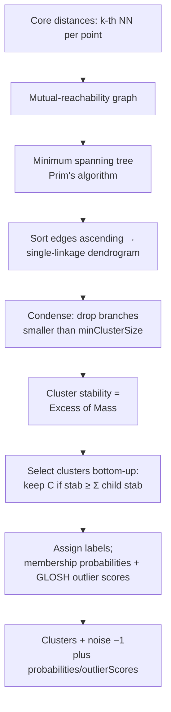

# HDBSCAN

> Part of [Clustering Algorithms](../clustering-algorithms.md). Algorithm: `hdbscan` (server-routed, heavy).

Hierarchical DBSCAN. Builds a hierarchy of DBSCAN clusterings across *all* density thresholds and extracts the most stable clusters via the **Excess of Mass** criterion — so it finds clusters of varying density without a single $\varepsilon$. It also returns soft **membership probabilities** and **GLOSH outlier scores**. Distances use the **haversine** great-circle metric when raw coordinates are supplied (matching the `esnz` `HDBSCAN(metric='haversine')` reference).

## Phases

1. **Core distances** — $\mathrm{core}_k(i)$ = distance from $i$ to its $k$-th nearest neighbour ($k=$ `minSamples`).
2. **Mutual reachability** — $d_{\text{mreach}}(i,j)=\max\bigl(\mathrm{core}_k(i),\mathrm{core}_k(j),d(i,j)\bigr)$.
3. **MST** — minimum spanning tree on the mutual-reachability graph (Prim, $\mathcal{O}(n^2)$).
4. **Dendrogram** — sort MST edges ascending and merge to form the single-linkage hierarchy.
5. **Condense** — walk top-down; branches smaller than `minClusterSize` "fall out" (recording death level $\lambda_{\text{death}}=1/d$).
6. **Stability (Excess of Mass)** — $\mathrm{stab}(C)=\sum_{p\in C}\bigl(\lambda_{\text{death}}(p)-\lambda_{\text{birth}}(C)\bigr)$; keep $C$ iff $\mathrm{stab}(C)\ge\sum_{\text{children}}\mathrm{stab}$.
7. **Labels + scores** — membership $\mathrm{prob}(p)=\lambda_{\text{death}}(p)/\lambda_{\max}(\text{cluster})$; GLOSH $\mathrm{outlier}(p)=1-\lambda_{\text{death}}(p)/\lambda_{\max}(\text{drop})$.

## How it works

## Parameters

| Key | Default | Description |
|---|---|---|
| `hdbscanMinClusterSize` | 5 | Smallest grouping considered a true cluster |
| `hdbscanMinSamples` | 5 | $k$ for the core-distance / density estimate |

Extra `ClusterResult` fields: `probabilities[]`, `outlierScores[]` (higher outlier score = more anomalous).

## References

- Campello, R. J. G. B., Moulavi, D., & Sander, J. (2013). Density-based clustering based on hierarchical density estimates. *PAKDD 2013*, LNAI 7819, 160–172. https://doi.org/10.1007/978-3-642-37456-2_14
- McInnes, L., Healy, J., & Astels, S. (2017). hdbscan: Hierarchical density based clustering. *Journal of Open Source Software*, **2**(11), 205. https://doi.org/10.21105/joss.00205
