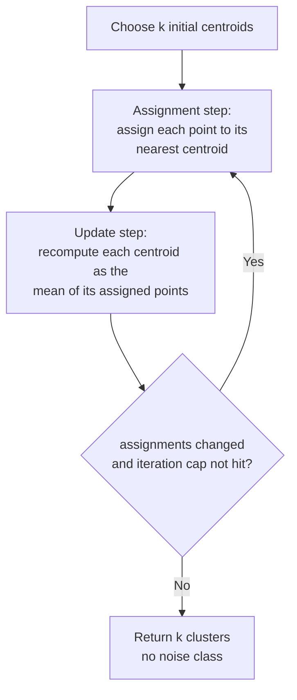

# k-Means

> Part of [Clustering Algorithms](../clustering-algorithms.md). Algorithm: `kmeans` (Worker-routed).

Partitions the events into exactly $k$ clusters by minimising the within-cluster sum of squares (Lloyd's algorithm). Unlike the density methods, **every point is assigned** — there is no noise class, so the "Hide Noise" display option is disabled for k-Means.

## Objective

Given clusters $C_1,\dots,C_k$ with centroids $\boldsymbol{\mu}_j$, minimise

$$
J = \sum_{j=1}^{k}\sum_{\mathbf{x}\in C_j}\lVert \mathbf{x}-\boldsymbol{\mu}_j\rVert^2 ,
\qquad
\boldsymbol{\mu}_j = \frac{1}{|C_j|}\sum_{\mathbf{x}\in C_j}\mathbf{x},
$$

over the projected-km coordinates $\mathbf{x}=(x,y)$.

## How it works

## Parameters

| Key | Default | Description |
|---|---|---|
| `k` | 5 | Number of clusters to create |

## References

- Lloyd, S. P. (1982). Least squares quantization in PCM. *IEEE Transactions on Information Theory*, **28**(2), 129–137. https://doi.org/10.1109/TIT.1982.1056489
- MacQueen, J. (1967). Some methods for classification and analysis of multivariate observations. *Proc. 5th Berkeley Symposium on Mathematical Statistics and Probability*, 281–297.
