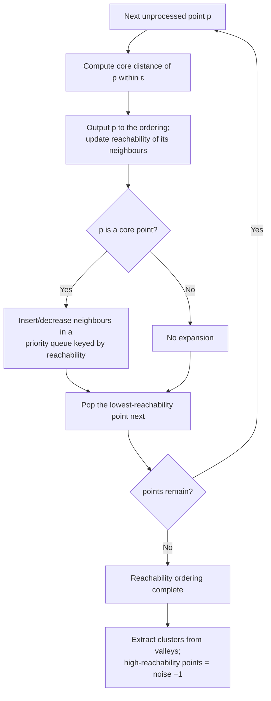

# OPTICS

> Part of [Clustering Algorithms](../clustering-algorithms.md). Algorithm: `optics` (Worker-routed).

Ordering Points To Identify the Clustering Structure. A generalisation of [DBSCAN](dbscan.md) that does not commit to a single density threshold: it produces a **reachability ordering** of the points that encodes cluster structure across all densities, then extracts clusters from that ordering. Points unreachable from any core are **noise** ($-1$). Implemented via the `density-clustering` library.

## Definitions

- **Core distance** of $p$: the smallest radius that makes $p$ a core point — the distance to its `minSamples`-th nearest neighbour (undefined if $p$ has fewer than `minSamples` neighbours within $\varepsilon$).
- **Reachability distance** of $q$ from $p$:

$$
\mathrm{reach\text{-}dist}(q,p) = \max\bigl(\mathrm{core\text{-}dist}(p),\; d(p,q)\bigr).
$$

Processing points in order of smallest reachability builds a 1-D reachability plot whose "valleys" are clusters.

## How it works

## Parameters

| Key | Default | Description |
|---|---|---|
| `epsilon` | 25 km | Maximum neighbourhood radius $\varepsilon$ |
| `minSamples` | 5 | Minimum points to form a core object |

## Reference

Ankerst, M., Breunig, M. M., Kriegel, H.-P., & Sander, J. (1999). OPTICS: Ordering points to identify the clustering structure. *ACM SIGMOD Record*, **28**(2), 49–60. https://doi.org/10.1145/304181.304187
