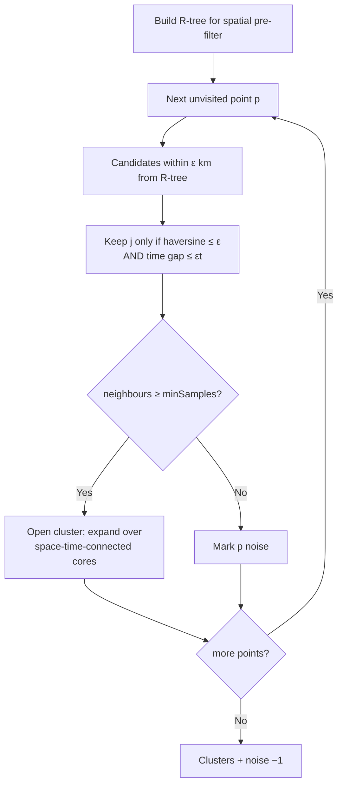

# ST-DBSCAN

> Part of [Clustering Algorithms](../clustering-algorithms.md). Algorithm: `st-dbscan` (Worker-routed).

Spatio-Temporal DBSCAN. Extends [DBSCAN](dbscan.md) so that two events are neighbours only when they are close in **both** space and time. The R-tree pre-filters spatial candidates in projected km, then the exact spatial test uses the **haversine** great-circle distance (matching the `esnz_aftershocks` `BallTree(metric='haversine')` reference).

## Neighbourhood

Event $j$ is a neighbour of event $i$ iff

$$
d_{\text{haversine}}(i,j)\le\varepsilon
\qquad\text{and}\qquad
\lvert t_i - t_j\rvert \le \varepsilon_t,
$$

where $\varepsilon$ is the spatial radius (km) and $\varepsilon_t$ the temporal window (days; timestamps are taken as fractional days). A point with at least `minSamples` such neighbours is a core point; density-connected cores form clusters and the rest are **noise** ($-1$).

## How it works

## Parameters

| Key | Default | Description |
|---|---|---|
| `epsilon` | 25 km | Spatial neighbourhood radius $\varepsilon$ |
| `epsilonTemporal` | 14 days | Temporal neighbourhood window $\varepsilon_t$ |
| `minSamples` | 5 | Minimum neighbours (both conditions must hold) |

## Reference

Birant, D., & Kut, A. (2007). ST-DBSCAN: An algorithm for clustering spatial–temporal data. *Data & Knowledge Engineering*, **60**(1), 208–221. https://doi.org/10.1016/j.datak.2006.01.013
