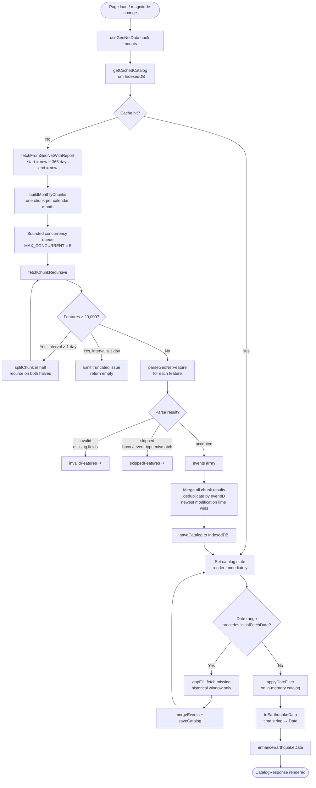
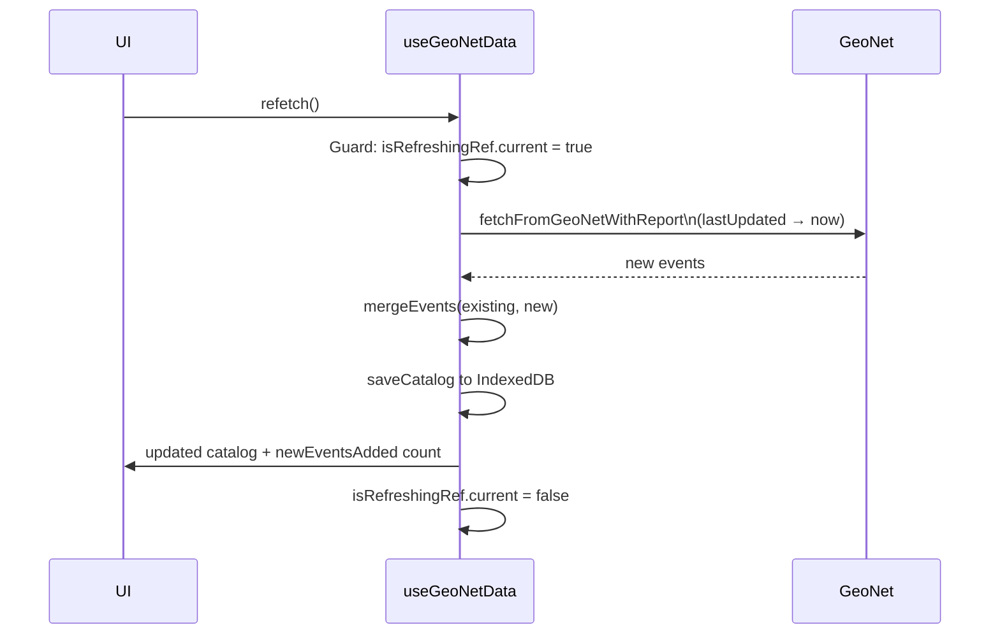
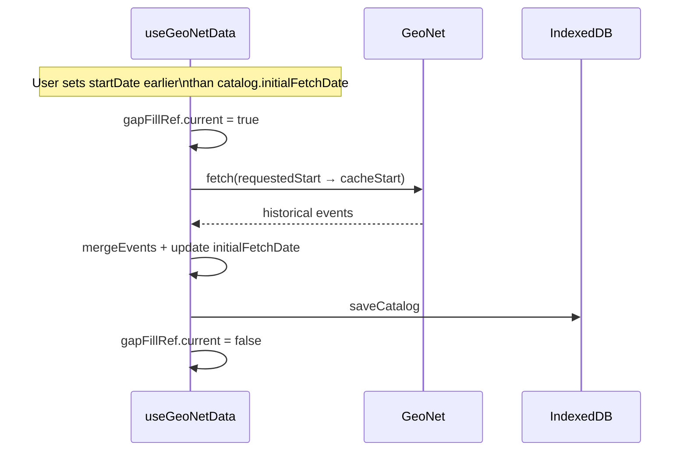

# Data Flow & Logic

## GeoNet fetch and caching pipeline

The full lifecycle from page load to rendered data, including cache hits and misses:



---

## GeoNet fetch internals

### Monthly chunking

`buildMonthlyChunks(startDate, endDate)` produces one chunk per calendar month using `date-fns/addMonths`. A 12-month window produces ~12 chunks processed with up to 5 running concurrently.

### Recursive date-splitting

When GeoNet returns ≥ 20,000 features for a chunk (its hard API limit), `fetchChunkRecursive` bisects the time interval and recurses on both halves. This continues until either:

- The chunk returns < 20,000 features, or
- The interval falls below `MIN_SPLIT_INTERVAL_MS` (24 hours), in which case a `truncated` issue is recorded.

### Retry policy

Each HTTP request goes through `fetchJsonWithRetry` with up to 3 attempts. Retryable status codes: 429, 500, 502, 503, 504. Back-off: `600ms × 2^(attempt−1)` plus up to 250ms jitter.

An HTTP 400 on a chunk (not a parse error) also triggers date-splitting before failing — this handles GeoNet's undocumented request-size rejections.

### Feature parsing

`parseGeoNetFeature` validates each GeoJSON feature and returns one of three values:

| Return value | Meaning |
|---|---|
| `StoredEarthquake` | Accepted — required fields present and within NZ bbox |
| `'invalid'` | Missing or unparseable required fields (eventID, time, lat, lon, depth, magnitude) |
| `'skipped'` | Valid record excluded by bbox or event-type filter |

Events with a null or absent `eventtype` field are **included** — GeoNet omits this field for unreviewed automatic solutions, which are overwhelmingly real earthquakes.

### Deduplication

After all chunks complete, `deduplicate()` merges by `eventID`. When the same event appears in overlapping chunk ranges (e.g. during a refresh that overlaps the previous fetch window), the copy with the newer `modificationTime` is kept.

---

## Incremental refresh

When the user clicks **"Check for New Events"**, `refetch()` runs an incremental fetch:



The refresh fetches from the catalog's `lastUpdated` timestamp to the current time, so only genuinely new events are downloaded regardless of how much time has elapsed.

---

## Gap-fill

Gap-fill triggers automatically when the user requests a date window that extends before `initialFetchDate`:



Gap-fill is non-fatal: if the historical fetch fails, the user sees whatever data is already cached and no error is thrown.

---

## Clustering pipeline

```mermaid
flowchart TD
    A([User clicks Run Clustering]) --> B{Algorithm type?}

    B -- Light algorithm\ndbscan / optics / kmeans\nstep-mag / step-time\nst-dbscan --> C[useClusteringWorker\npost to Web Worker]

    B -- Heavy algorithm\nhdbscan / nearest-neighbor\ntmc / hardebeck-2019 --> D[POST /api/cluster\nJSON body]

    C --> E[clustering.worker.ts\nreceives Float64Array\nvia Transferable transfer]
    E --> F[runClustering\nselect algorithm]
    F --> G{Timeout > 30s?}
    G -- Yes --> H[terminate worker\nreturn error]
    G -- No --> I[ClusterResult\npostMessage back]

    D --> J[/api/cluster/route.ts]
    J --> K{SHA-256 hash\nin LRU cache?}
    K -- Hit\nTTL < 15 min --> L[Return cached result]
    K -- Miss --> M[runClustering\nserver-side]
    M --> N[Store in LRU\nmax 30 entries]
    N --> L

    I --> O[setClusters in\nTemporalSpatial state]
    L --> O
    O --> P[LeafletClusterMap\ncolour by label]
    O --> Q[TemporalSpatial3DPlot\ncolour by label]
```

### Data encoding for the worker

Each earthquake is encoded as 5 `float64` values in a `Float64Array` before being sent to the Web Worker:

```
[latitude, longitude, depth, magnitude, timeMs]
```

The buffer is transferred (not copied) via `postMessage(request, [buffer.buffer])`, giving zero-copy handoff. The worker re-inflates the flat array back into point objects before running the algorithm.

---

## Fetch report and warnings

`fetchFromGeoNetWithReport` returns a `GeoNetFetchReport` alongside the event array:

```typescript
interface GeoNetFetchReport {
    events: StoredEarthquake[];
    chunksTotal: number;
    chunksSucceeded: number;
    chunksFailed: number;
    chunksEmpty: number;
    chunksSplit: number;
    truncatedChunks: number;
    invalidFeatures: number;   // missing/unparseable required fields
    skippedFeatures: number;   // valid records excluded by bbox or event-type
    duplicateEvents: number;
    partial: boolean;
    issues: GeoNetFetchIssue[];
}
```

`partial` is `true` when `chunksFailed > 0` or `truncatedChunks > 0`. The UI renders a dismissable amber warning panel when `partial` is `true`.

`skippedFeatures` (bbox/event-type mismatches) are **not** shown as UI warnings — they are expected and not errors.
