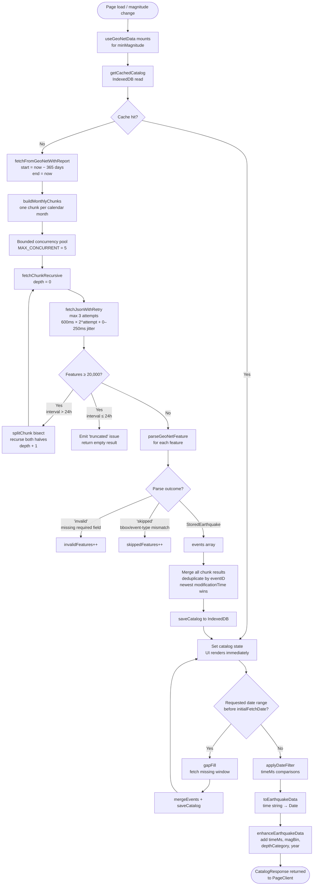
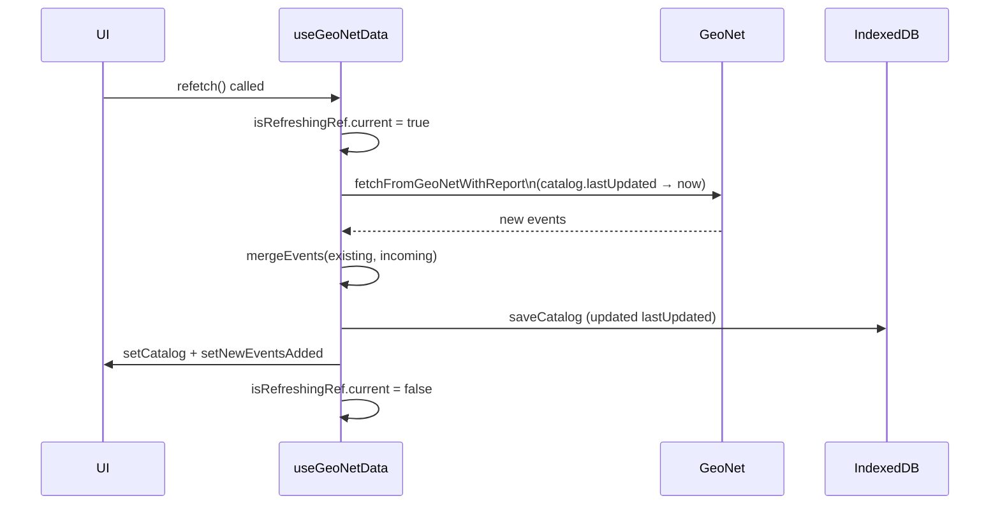
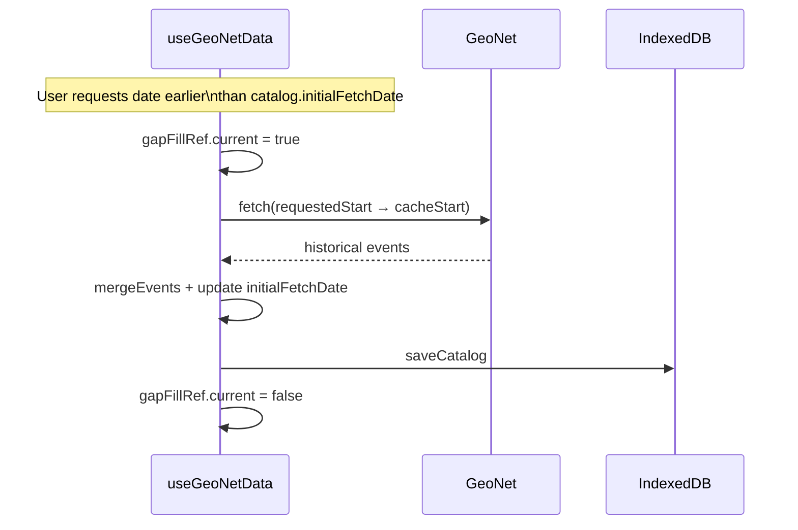
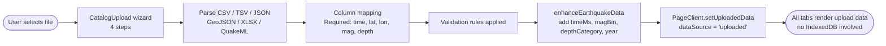
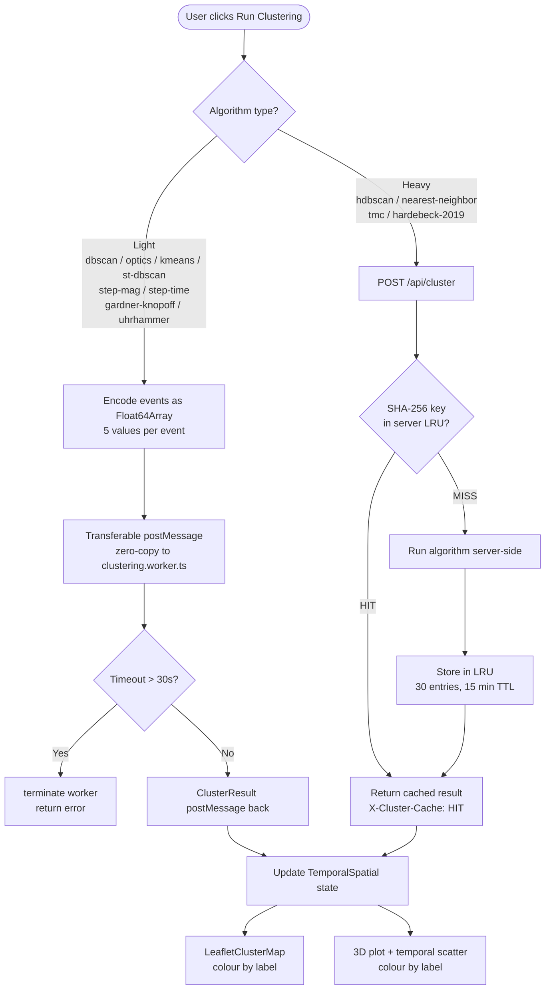

# Data Flow & Logic

## GeoNet fetch and caching pipeline



---

## Monthly chunking

`buildMonthlyChunks(startDate, endDate)` uses `date-fns/addMonths` to produce one chunk per calendar month. A 12-month window produces ~12 chunks processed with up to 5 concurrent requests.

---

## Retry policy

Each HTTP request passes through `fetchJsonWithRetry`:

| Attempt | Delay before retry |
|---|---|
| 1 → 2 | \(600\ \text{ms} + \mathrm{Uniform}(0, 250)\ \text{ms}\) |
| 2 → 3 | \(1{,}200\ \text{ms} + \mathrm{Uniform}(0, 250)\ \text{ms}\) |

Retryable status codes: **429, 500, 502, 503, 504**.

An HTTP **400** on a chunk also triggers date-splitting before failing — this handles GeoNet's undocumented request-size rejections for very active periods.

---

## Recursive date splitting

When GeoNet returns \(\geq 20{,}000\) features for a chunk:

1. If the interval is \(> \mathrm{MIN\_SPLIT\_INTERVAL\_MS}\) (24 hours): bisect the interval into two equal halves, run both concurrently, merge results.
2. If the interval is \(\leq 24\) hours: record a `truncated` issue and return empty — the data for that window is genuinely too dense to retrieve in full.

---

## Feature parsing

`parseGeoNetFeature(feature, eventType?)` returns one of three values:

| Return | Condition | Counter |
|---|---|---|
| `StoredEarthquake` | All required fields present and within NZ bbox | — |
| `'invalid'` | Missing or unparseable: `eventID`, `time`, lat, lon, depth, or magnitude | `invalidFeatures++` |
| `'skipped'` | Valid record excluded by bbox or event-type filter | `skippedFeatures++` |

**Null `eventtype` events are included.** GeoNet omits `eventtype` for unreviewed automatic solutions, which are overwhelmingly real earthquakes. The filter only rejects records where `eventtype` is explicitly set to a different type.

---

## Deduplication

After all chunks complete, `deduplicate()` merges by `eventID`. When the same event appears in two overlapping chunks, the copy with the newer `modificationTime` is kept. The final array is sorted by `timeMs` descending.

---

## Fetch report

```typescript
interface GeoNetFetchReport {
    events:           StoredEarthquake[];
    chunksTotal:      number;
    chunksSucceeded:  number;
    chunksFailed:     number;
    chunksEmpty:      number;        // chunks with 0 valid events after filters
    chunksSplit:      number;        // total bisections performed
    truncatedChunks:  number;        // chunks hitting 20,000 limit at ≤1 day interval
    invalidFeatures:  number;        // missing/unparseable required fields
    skippedFeatures:  number;        // valid records excluded by bbox or event-type
    duplicateEvents:  number;
    partial:          boolean;       // true if chunksFailed > 0 || truncatedChunks > 0
    issues:           GeoNetFetchIssue[];
}
```

`partial: true` causes a dismissable amber warning panel in the UI. `skippedFeatures` is **not** shown as a warning — it is expected behaviour.

---

## Incremental refresh



---

## Gap-fill



---

## Magnitude switch behaviour

When `minMagnitude` changes, `loadingMagRef` tracks the in-flight magnitude number. In-flight callbacks check `magnitudeRef.current !== magnitude` before applying results, discarding stale responses if the user switches rapidly.

---

## Uploaded catalog flow



---

## Clustering pipeline



### Data encoding for the Web Worker

Each earthquake is packed into a flat `Float64Array` with 5 values per event:

$$\underbrace{\phi_0,\;\lambda_0,\;z_0,\;M_0,\;t_0}_{\text{event 0}},\;\underbrace{\phi_1,\;\lambda_1,\;z_1,\;M_1,\;t_1}_{\text{event 1}},\;\ldots$$

The buffer is **transferred** (not copied) via `postMessage`, giving zero-copy handoff. After transfer, `buf.buffer` is detached in the main thread.

### Reservoir sampling before clustering

If \(n > 5{,}000\), events are subsampled using **Knuth's reservoir algorithm** before encoding. Each event has equal probability \(5000/n\) of inclusion, preserving the statistical distribution of the full catalog.

---

## Aftershock declustering

### SRL / Hardebeck window method

**Rupture length** (Wells-Coppersmith 1994):

$$\mathrm{RL}(M) = 10^{-2.44 + 0.59M} \quad [\text{km}]$$

**Algorithm** (events processed largest-first):

1. Skip candidate if within \(T_{\text{excl}} = 3\) years and \(5 \times \mathrm{RL}\) of a larger event
2. Tag events within \(T_w = 10\) days and \(3 \times \mathrm{RL}\) km as aftershocks

### Gardner-Knopoff window method

**Spatial window:**

$$W_s(M) = 10^{0.1238 M + 0.983} \quad [\text{km}]$$

**Temporal window** (piecewise — the published Gardner-Knopoff 1974 form):

$$W_t(M) = \begin{cases} 10^{\,0.032 M + 2.7389} & M \ge 6.5 \\[4pt] 10^{\,0.5409 M - 0.547} & M < 6.5 \end{cases} \quad [\text{days}]$$

Events within both windows of a larger event are marked as dependent. The Aftershock Sequence tab uses these windows for aftershock identification; the same definitions are also exposed as the `gardner-knopoff` (and `uhrhammer`) clustering algorithms in the Temporal-Spatial tab — see [Clustering Algorithms](clustering-algorithms.md#gardner-knopoff-1974).
