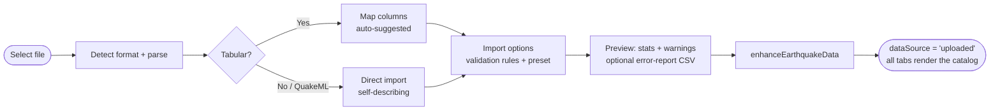

# Data Sources

ESNZ-ForecastApp works with **two co-equal data sources**, switchable in-app:

1. **Live GeoNet stream** — fetched from GeoNet's public quakesearch API, cached in the browser.
2. **Your own uploaded catalog** — CSV/TSV/TXT, JSON/GeoJSON, Excel, DAT, or QuakeML.

A data-source toggle (`dataSource: 'geonet' | 'uploaded'`) controls which feeds the app; uploading a file switches to `'uploaded'` and a **"back to GeoNet"** control restores the live stream. Uploaded data is held in memory and **bypasses IndexedDB** (it is not persisted across reloads). Both sources are passed through the same enhancement step (adds `timeMs`, `magBin`, `depthCategory`, `year`, locality) so every tab works identically regardless of origin.

---

## 1. Live GeoNet stream

Earthquake data is fetched from GeoNet via a server-side CORS proxy, split into monthly chunks with bounded concurrency, retried with back-off, recursively bisected when a chunk hits GeoNet's 20,000-feature cap, deduplicated, and cached in **IndexedDB** per magnitude threshold. Incremental refresh and historical gap-fill keep the cache current.

See **[Data Flow & Logic](data-flow.md)** for the full pipeline (chunking, retry policy, bisection, fetch report, caching, refresh, gap-fill — with diagrams). The NZ bounding box applied during parsing is `[163.0, −49.0, 179.9, −27.0]` (lon/lat), and event-type filtering (default `earthquake`) is applied client-side because GeoNet rejects the `eventtype` query parameter.

---

## 2. Catalog upload

Import a catalog through a wizard (`CatalogUpload.tsx`). Two paths are offered:

- **Quick import** — auto-detects columns/format and imports immediately.
- **Advanced import** — a 4-step wizard: **Select file → Map columns → Import options → Preview & import**.

Files are drag-and-drop or browse, up to **200 MB**.

### Supported formats

| Format | Extensions | Notes |
|---|---|---|
| Delimited text | `.csv` `.tsv` `.txt` `.tab` | Delimiter auto-detected (`,` `;` tab `\|`); quoted fields; comment lines (`#`, `//`, `%`) skipped |
| JSON / GeoJSON | `.json` `.geojson` | Plain arrays, or GeoJSON `FeatureCollection` (extracts `coordinates` → lon/lat/depth); falls back to the first array property |
| Excel | `.xlsx` `.xls` | First worksheet only; converted to CSV internally |
| DAT | `.dat` | Whitespace-delimited records (converted to comma-delimited when no delimiter is present) |
| QuakeML | `.qml` `.quakeml` `.xml` | Self-describing → imported directly (no column mapping); depth m→km; uses preferred origin/magnitude; namespace-agnostic |

### Column mapping

For tabular formats the wizard **auto-suggests** mappings from a column-alias table (recognises `latitude/lat`, `longitude/lon`, `magnitude/mag/ml/mw/mb/ms`, `depth`, `time/date`, GeoNet suffixes, etc.). You can:

- Map a **single datetime column**, or assemble from **split** year / month / day / hour / minute / second columns (auto-detected).
- Add **custom target fields** to carry through extra columns.
- Toggle which columns are included; required fields (time, latitude, longitude, magnitude, depth) are validated before import.

**Date formats** (8): `dd/mm/yyyy`, `mm/dd/yyyy`, `yyyy-mm-dd`, ISO 8601, **Unix seconds**, **Unix milliseconds**, and auto-detect (~17 patterns, NZ day-first tie-break, 2-digit-year handling).

**Coordinate formats** (3): decimal degrees, **DMS** (degrees-minutes-seconds), and **decimal-minutes**.

### Validation & preview

Import options apply a configurable rule set with two **presets** — **Global Default** and **New Zealand Region** — plus a custom editor:

- magnitude min/max, depth min/max, latitude/longitude bounds, minimum year, allow-future-dates, and **skip-invalid-rows**.

The **Preview & import** step shows total / valid / invalid counts, success rate, magnitude / depth / time ranges, geographic bounds, and sample warnings. Per-row validation errors can be exported as a **downloadable CSV error report**.

---

## Data enhancement (both sources)

Every record — GeoNet or uploaded — passes through `enhanceEarthquakeData`, which adds:

| Field | Meaning |
|---|---|
| `timeMs` | Pre-computed epoch ms (fast filtering/sorting) |
| `magBin` | `floor(magnitude)` |
| `depthCategory` | Shallow (≤ 70 km) · Intermediate (≤ 300 km) · Deep (> 300 km) |
| `year` | Calendar year |
| locality | Nearest NZ region label when coordinates are present |

This is why uploaded catalogs behave identically to the live stream across clustering, statistics, and the Sandbox.
