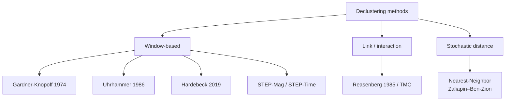
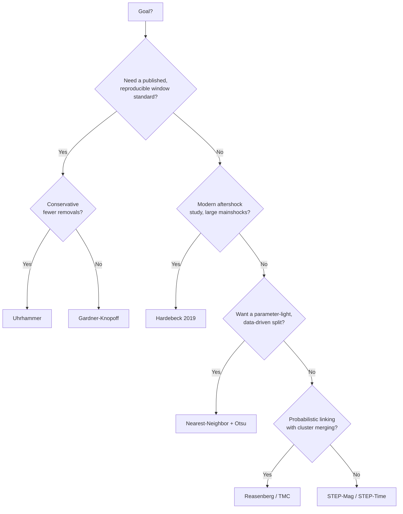

# Declustering Methods

**Declustering** separates an earthquake catalog into *independent* events (background / mainshocks) and *dependent* events (foreshocks and aftershocks triggered by a larger event). ESNZ-ForecastApp implements seven declustering / sequence-identification methods, spanning three methodological families.

Each method has its own page with a step-by-step **Mermaid** diagram of how it works:

| Method | Family | Page |
|---|---|---|
| Gardner-Knopoff (1974) | Window | [gardner-knopoff.md](declustering/gardner-knopoff.md) |
| Uhrhammer (1986) | Window | [uhrhammer.md](declustering/uhrhammer.md) |
| Hardebeck (2019) | Window | [hardebeck-2019.md](declustering/hardebeck-2019.md) |
| STEP — Magnitude | Window | [step-mag.md](declustering/step-mag.md) |
| STEP — Time | Window | [step-time.md](declustering/step-time.md) |
| Reasenberg / TMC (1985) | Link / interaction | [reasenberg-tmc.md](declustering/reasenberg-tmc.md) |
| Nearest-Neighbor (Zaliapin–Ben-Zion) | Stochastic distance | [nearest-neighbor.md](declustering/nearest-neighbor.md) |

> The pure density clustering algorithms (DBSCAN, OPTICS, k-Means, ST-DBSCAN, HDBSCAN) are *clustering*, not *declustering*, and are documented in [Clustering Algorithms](clustering-algorithms.md). All distances are **haversine** great-circle km; parameter defaults match the [full parameter reference](clustering-algorithms.md#full-parameter-reference).

---

## Method family



---

## Comparison at a glance

| Method | Family | Mainshock order | Spatial window | Temporal window | Symmetric? | Routing |
|---|---|---|---|---|---|---|
| [Gardner-Knopoff](declustering/gardner-knopoff.md) | Window | Magnitude desc | $10^{0.1238M+0.983}$ km | piecewise (M≥6.5 split) | Yes (fore+after) | Worker |
| [Uhrhammer](declustering/uhrhammer.md) | Window | Magnitude desc | $e^{-1.024+0.804M}$ km | $e^{-2.870+1.235M}$ d | Configurable | Worker |
| [Hardebeck (2019)](declustering/hardebeck-2019.md) | Window | Magnitude desc | $\max(10,\,r_{\text{mult}}\!\cdot\!\mathrm{RL})$ km | forward only $T_w$ | No (aftershocks only) | Server |
| [STEP-Mag](declustering/step-mag.md) / [STEP-Time](declustering/step-time.md) | Window | Mag-desc / chronological | Wells-Coppersmith RL | sliding $T_1,T_2$ | Both directions | Worker |
| [Reasenberg / TMC](declustering/reasenberg-tmc.md) | Link | Chronological | $r_1+r_{\text{main}}\le 30$ km | adaptive $\tau$ | Forward growth | Server |
| [Nearest-Neighbor](declustering/nearest-neighbor.md) | Distance | Chronological | in $\eta$ metric | in $\eta$ metric | Causal (parent earlier) | Server |

---

## Choosing a method



- **Gardner-Knopoff** — the de-facto reference for hazard studies; symmetric windows, removes the most events.
- **Uhrhammer** — same engine, shorter windows; use when GK over-declusters.
- **Hardebeck (2019)** — best for explicit large-mainshock aftershock sequences; aftershocks only.
- **STEP** — operational short-term forecasting style; sliding windows track migrating sequences.
- **Reasenberg / TMC** — physically-motivated, adaptive, merges interacting sequences.
- **Nearest-Neighbor** — fewest assumptions; lets the catalog's own $\eta$ distribution define the threshold.

See [Clustering Algorithms](clustering-algorithms.md) for routing (Worker vs server), the coordinate system, and the complete `SpatialClusteringOptions` reference.

```{toctree}
:hidden:
:maxdepth: 1

declustering/gardner-knopoff
declustering/uhrhammer
declustering/hardebeck-2019
declustering/step-mag
declustering/step-time
declustering/reasenberg-tmc
declustering/nearest-neighbor
```
