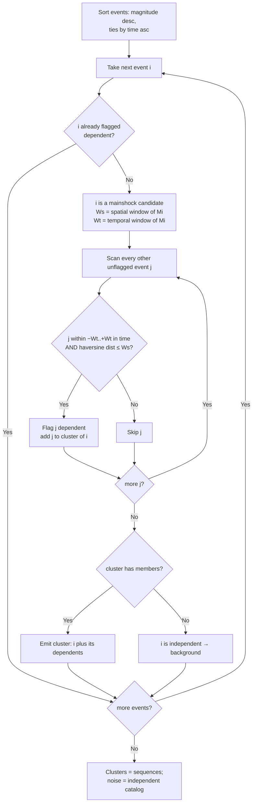

# Gardner-Knopoff (1974)

> Part of [Declustering Methods](../declustering-methods.md). Algorithm: `gardner-knopoff` (Worker-routed).

The original and most widely used **window** declustering. Each event defines a magnitude-dependent spatial window \(W_s\) and temporal window \(W_t\). Working from the largest event down, any smaller event inside *both* windows of a larger event is declared a dependent (foreshock or aftershock) and removed from the independent catalog. Distances are haversine great-circle km.

## Windows

An event of magnitude \(M\) defines a spatial interaction radius \(W_s(M)\) and a temporal window \(W_t(M)\):

$$
W_s(M) = 10^{\,0.1238\,M \,+\, 0.983}\quad[\mathrm{km}],
$$

$$
W_t(M) = \begin{cases}
10^{\,0.032\,M \,+\, 2.7389} & M \ge 6.5,\\[6pt]
10^{\,0.5409\,M \,-\, 0.547} & M < 6.5,
\end{cases}\quad[\mathrm{days}].
$$

A smaller event \(j\) is flagged **dependent** on a larger event \(i\) if and only if it lies inside both windows:

$$
d_{ij}\;\le\;W_s(M_i)
\qquad\text{and}\qquad
-f\,W_t(M_i)\;\le\;t_j - t_i\;\le\;W_t(M_i),
$$

where \(d_{ij}\) is the haversine great-circle distance, \(t_{(\cdot)}\) is origin time, and \(f=\texttt{fsTimeProp}=1\) makes Gardner-Knopoff **symmetric** (foreshock look-back \(=\) aftershock look-forward).

The temporal window is **piecewise** in magnitude — the published Gardner-Knopoff form. Applying the \(M\ge 6.5\) branch to small events grossly over-windows them (e.g. \(M5 \Rightarrow {\sim}707\) d instead of the correct \({\sim}84\) d), so the breakpoint is honoured. Setting `gkPiecewiseTemporal = false` uses a single \(W_t(M)=10^{\,cM+d}\) form for all magnitudes. The analytic exponential coefficients are the ZMAP / CORSSA parameterization of the original Gardner & Knopoff (1974) tabulated windows.

## How it works

Because events are processed largest-first and a flagged dependent can never become a mainshock, every cluster is anchored on the single largest event in its space-time neighbourhood.

## Parameters

| Key | Default | Description |
|---|---|---|
| `gkSpatialA` | 0.1238 | Spatial exponent slope \(a\) in \(10^{aM+b}\) |
| `gkSpatialB` | 0.983 | Spatial exponent intercept \(b\) |
| `gkTemporalC` | 0.032 | Temporal slope \(c\) (M≥6.5 branch / non-piecewise) |
| `gkTemporalD` | 2.7389 | Temporal intercept \(d\) |
| `gkPiecewiseTemporal` | `true` | Use the published M≥6.5 piecewise temporal window |

## References

- Gardner, J. K., & Knopoff, L. (1974). Is the sequence of earthquakes in Southern California, with aftershocks removed, Poissonian? *Bulletin of the Seismological Society of America*, **64**(5), 1363–1367. https://doi.org/10.1785/BSSA0640051363
- van Stiphout, T., Zhuang, J., & Marsan, D. (2012). Seismicity declustering. *Community Online Resource for Statistical Seismicity Analysis (CORSSA)*. https://doi.org/10.5078/corssa-52382934 — source of the analytic window coefficients used here.
