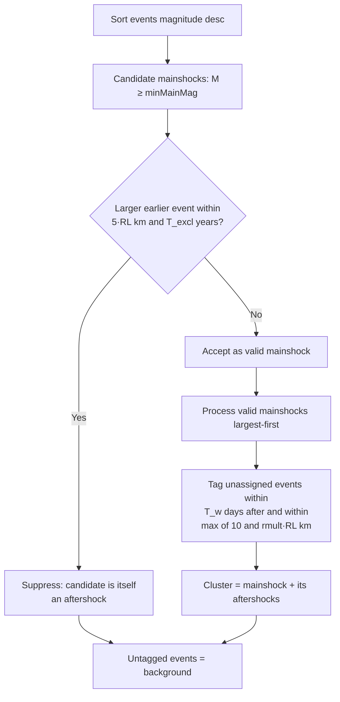

# Hardebeck (2019)

> Part of [Declustering Methods](../declustering-methods.md). Algorithm: `hardebeck-2019` (server-routed, heavy).

A modern rupture-length window method. Unlike Gardner-Knopoff it is **one-directional** (aftershocks only, no foreshock window) and uses an explicit mainshock-suppression rule so a sequence is never anchored on one of its own foreshocks.

## Windows

The subsurface rupture length follows Wells & Coppersmith (1994), and the aftershock collection radius is bounded below by 10 km:

$$
\mathrm{RL}(M) = 10^{\,0.59\,M \,-\, 2.44}\quad[\mathrm{km}],
\qquad
r(M) = \max\!\bigl(10,\; r_{\text{mult}}\cdot \mathrm{RL}(M)\bigr)\quad[\mathrm{km}].
$$

An event \(j\) is an **aftershock** of mainshock \(i\) (magnitude \(M_i\ge M_{\min}\)) when it follows within the radius and time window:

$$
d_{ij}\le r(M_i)
\qquad\text{and}\qquad
0 < t_j - t_i \le T_w .
$$

A candidate \(M_i\ge M_{\min}\) is **suppressed** — reclassified as an aftershock rather than a mainshock — if some larger event \(k\) (\(M_k>M_i\)) preceded it within

$$
d_{ik}\le 5\,\mathrm{RL}(M_k)
\qquad\text{and}\qquad
0 < t_i - t_k \le T_{\text{excl}} ,
$$

so a sequence is never anchored on one of its own foreshocks. The method is **one-directional** (aftershocks only; no foreshock window).

## How it works

## Parameters

| Key | Default | Description |
|---|---|---|
| `hardebeckMinMag` | 5.0 | Minimum magnitude for a valid mainshock |
| `hardebeckTimeWindow` | 10 d | Aftershock collection window \(T_w\) |
| `hardebeckRuptureMult` | 3 | Spatial radius multiplier \(r_{\text{mult}}\) (floor 10 km) |
| `hardebeckMainshockTimeYears` | 3 yr | Mainshock-suppression look-back \(T_{\text{excl}}\) |

## References

- Hardebeck, J. L., Llenos, A. L., Michael, A. J., Page, M. T., & van der Elst, N. (2019). Updated California aftershock parameters. *Seismological Research Letters*, **90**(1), 262–270. https://doi.org/10.1785/0220180240
- Wells, D. L., & Coppersmith, K. J. (1994). New empirical relationships among magnitude, rupture length, rupture width, rupture area, and surface displacement. *Bulletin of the Seismological Society of America*, **84**(4), 974–1002.
