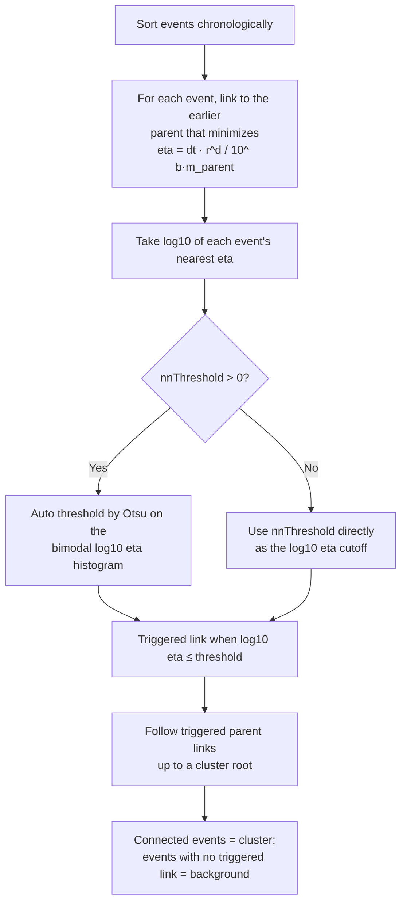

# Nearest-Neighbor (Zaliapin–Ben-Zion)

> Part of [Declustering Methods](../declustering-methods.md). Algorithm: `nearest-neighbor` (server-routed, heavy).

A **stochastic-distance** method. It does not use fixed windows; instead it scores every event by its rescaled nearest-neighbour distance $\eta$ to an earlier event, then separates the bimodal $\eta$ population into clustered (low $\eta$) and background (high $\eta$).

## Distance metric

The rescaled space-time-magnitude distance from a child event $i$ to an earlier parent $j$ is

$$
\eta(i,j) = t_{ij}\,\bigl(r_{ij}\bigr)^{d}\,10^{-b\,m_j},
\qquad d = 1.6,\; b = 1.0,
$$

where $t_{ij} = t_i - t_j > 0$ (the parent strictly **precedes** the child, enforcing causality), $r_{ij}$ is the haversine great-circle distance $[\mathrm{km}]$, $m_j$ is the parent magnitude, $d$ is the fractal dimension of the hypocentre set, and $b$ is the Gutenberg–Richter $b$-value. Each event takes its **nearest-neighbour** proximity

$$
\eta_i = \min_{\,t_j < t_i}\,\eta(i,j).
$$

The population of $\log_{10}\eta_i$ is bimodal — a clustered mode at low $\eta$ and a background mode at high $\eta$. A link is *triggered* (the event is dependent) when

$$
\log_{10}\eta_i \;\le\; \theta,
$$

where the threshold $\theta$ is either inferred automatically by **Otsu** between-class-variance maximization on the $\log_{10}\eta$ histogram (`nnThreshold > 0`) or supplied explicitly (`nnThreshold ≤ 0`). Clusters are the connected components formed by following triggered parent links to a root; events with no triggered link are background.

## How it works

The $\log_{10}\eta$ distribution of real catalogs is bimodal — a clustered mode at low $\eta$ and a background mode at high $\eta$. Otsu's method places the threshold in the valley between them automatically; supply `nnThreshold ≤ 0` to set the cutoff explicitly.

## Parameters

| Key | Default | Description |
|---|---|---|
| `nnThreshold` | 1.0 | $>0$ → Otsu auto-threshold on $\log_{10}\eta$; $\le 0$ → explicit $\log_{10}\eta$ cutoff |

## References

- Zaliapin, I., & Ben-Zion, Y. (2013). Earthquake clusters in southern California I: Identification and stability. *Journal of Geophysical Research: Solid Earth*, **118**(6), 2847–2864. https://doi.org/10.1002/jgrb.50179
- Zaliapin, I., & Ben-Zion, Y. (2020). Earthquake declustering using the nearest-neighbor approach in space-time-magnitude domain. *Journal of Geophysical Research: Solid Earth*, **125**(4), e2018JB017120. https://doi.org/10.1029/2018JB017120
- Otsu, N. (1979). A threshold selection method from gray-level histograms. *IEEE Transactions on Systems, Man, and Cybernetics*, **9**(1), 62–66. https://doi.org/10.1109/TSMC.1979.4310076
