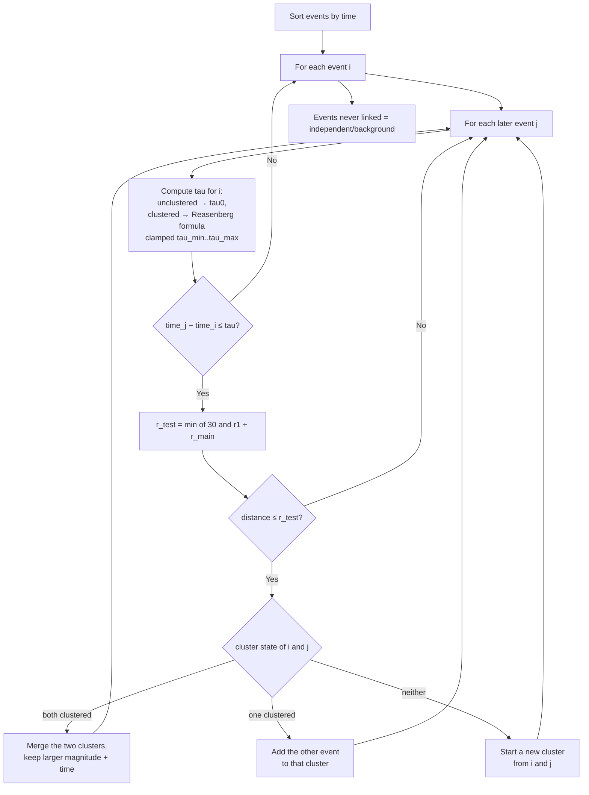

# Reasenberg / TMC (1985)

> Part of [Declustering Methods](../declustering-methods.md). Algorithm: `tmc` (server-routed, heavy).

A **link-based** declustering algorithm (the canonical `cluster2000x.f`). Instead of a fixed window it grows clusters by chaining events that fall inside an adaptive, probabilistic interaction zone; separate clusters that become linked are **merged**.

## Interaction zone

**Spatial** — the interaction radius is the sum of the Kanamori–Anderson (1975) crack radii of the test event (magnitude \(M_1\)) and the cluster's largest event (\(M_{\max}\)), capped at one crustal thickness. The cap applies to the **sum**, and \(r_{\text{main}}\) does **not** scale by \(r_{\text{fact}}\):

$$
r_{\text{test}} = \min\!\Bigl(30,\;
\underbrace{r_{\text{fact}}\cdot 0.011\cdot 10^{\,0.4\,M_1}}_{r_1}
\;+\;
\underbrace{0.011\cdot 10^{\,0.4\,M_{\max}}}_{r_{\text{main}}}\Bigr)
\quad[\mathrm{km}].
$$

**Temporal** — an adaptive look-ahead time that lengthens with the cluster's largest magnitude \(M_{\max}\) and the elapsed time \(t\) since that event:

$$
\Delta M = \max\!\bigl(0,\;(1-x_k)\,M_{\max} - M_{\min}\bigr),
\qquad
\tau(t) = \frac{-\ln(1-p_1)\,t}{10^{\,(\Delta M - 1)\,\tfrac{2}{3}}}\quad[\mathrm{days}].
$$

The effective look-ahead applied to a pair is

$$
\tau_{\text{eff}} =
\begin{cases}
\tau_0 & \text{test event unclustered},\\[4pt]
\min\!\bigl(\tau_{\max},\,\max(\tau_{\min},\,\tau(t))\bigr) & \text{test event clustered}.
\end{cases}
$$

\(\Delta M\) is floored at 0 so a small-cluster denominator cannot inflate \(\tau\). \(t\) is measured from the **largest** event in the cluster, and \(\tau_{\text{eff}}\) is recomputed on every pair, so an event that joins a cluster mid-scan immediately gets the wider window.

## How it works

## Parameters

| Key | Default | Description |
|---|---|---|
| `tmcRfact` | 10 | Spatial radius multiplier \(r_{\text{fact}}\) |
| `tmcTau0` | 2 d | Look-ahead for an unclustered event \(\tau_0\) |
| `tmcTauMax` | 10 d | Maximum look-ahead \(\tau_{\max}\) |
| `tmcP1` | 0.99 | Interaction probability \(p_1\) |
| `tmcXk` | 0.5 | Magnitude scaling \(x_k\) |
| `tmcMinMag` | 1.5 | Effective minimum magnitude \(M_{\min}\) |

\(\tau_{\min} = 1\) d is a fixed internal lower clamp (not an exposed option).

## References

- Reasenberg, P. (1985). Second-order moment of central California seismicity, 1969–1982. *Journal of Geophysical Research*, **90**(B7), 5479–5495. https://doi.org/10.1029/JB090iB07p05479
- Kanamori, H., & Anderson, D. L. (1975). Theoretical basis of some empirical relations in seismology. *Bulletin of the Seismological Society of America*, **65**(5), 1073–1095.
- van Stiphout, T., Zhuang, J., & Marsan, D. (2012). Seismicity declustering. *Community Online Resource for Statistical Seismicity Analysis (CORSSA)*. https://doi.org/10.5078/corssa-52382934
