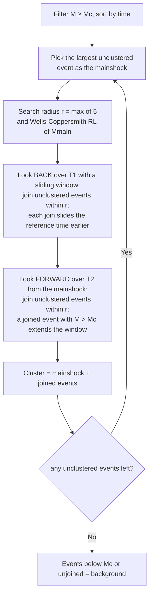

# STEP — Magnitude Clustering

> Part of [Declustering Methods](../declustering-methods.md). Algorithm: `step-mag` (Worker-routed). See also [STEP-Time](step-time.md).

STEP (Short-Term Earthquake Probability) clustering of Christophersen, processing events **largest-magnitude first**. Sequences are built with **sliding** space-time windows seeded on the Wells-Coppersmith rupture length. Events are first filtered to $M \ge M_c$.

## Window

The spatial search radius is the Wells & Coppersmith (1994) rupture length, floored at 5 km:

$$
r(M) = \max\!\bigl(5,\; 10^{\,0.59\,M \,-\, 2.44}\bigr)\quad[\mathrm{km}].
$$

An event $j$ joins the sequence of reference event $i$ when $d_{ij}\le r(M_i)$ and it falls in the current time window $[\,t_{\text{ref}}-T_1,\; t_{\text{ref}}+T_2\,]$. The reference time $t_{\text{ref}}$ **slides** forward each time a qualifying event ($M > M_c$) is absorbed, so a sequence can extend well beyond $T_2$ of the original mainshock. Only events with $M \ge M_c$ enter the analysis.

## How it works

## Parameters

| Key | Default | Description |
|---|---|---|
| `stepMinMag` | 2.0 | Completeness / seed magnitude $M_c$ |
| `stepT1` | 1 d | Look-back window $T_1$ |
| `stepT2` | 30 d | Look-forward window $T_2$ |

## References

- Gerstenberger, M. C., Wiemer, S., Jones, L. M., & Reasenberg, P. A. (2005). Real-time forecasts of tomorrow's earthquakes in California. *Nature*, **435**, 328–331. https://doi.org/10.1038/nature03622 — the STEP forecasting model.
- Wells, D. L., & Coppersmith, K. J. (1994). New empirical relationships among magnitude, rupture length, rupture width, rupture area, and surface displacement. *Bulletin of the Seismological Society of America*, **84**(4), 974–1002. — rupture-length spatial window.
- Christophersen, A. (2008). STEP magnitude clustering MATLAB implementation (`clusterSTEPmag`).
