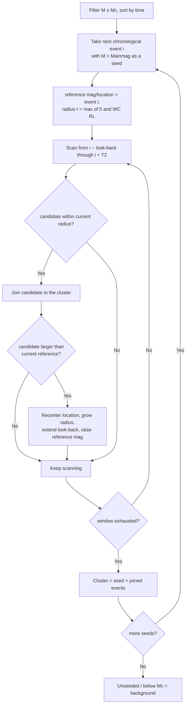

# STEP — Time Clustering

> Part of [Declustering Methods](../declustering-methods.md). Algorithm: `step-time` (Worker-routed). See also [STEP-Mag](step-mag.md).

The chronological variant of STEP clustering. Events are filtered to \(M \ge M_c\) and processed in **time order**; each new mainshock seeds a sequence, and when a *larger* event joins that sequence the reference location, radius and look-back window are updated to the larger event — letting the window track a migrating sequence.

## Window

The spatial search radius is the Wells & Coppersmith (1994) rupture length of the current reference event, floored at 5 km:

$$
r(M_{\text{ref}}) = \max\!\bigl(5,\; 10^{\,0.59\,M_{\text{ref}} \,-\, 2.44}\bigr)\quad[\mathrm{km}].
$$

When a joined event has \(M > M_{\text{ref}}\), the reference magnitude, location \((\phi_{\text{ref}},\lambda_{\text{ref}})\) and look-back window are reset to that larger event, so \(r\) **grows** and the window re-centres to follow a migrating sequence. Only events with \(M \ge M_c\) enter the analysis.

## How it works

## Parameters

| Key | Default | Description |
|---|---|---|
| `stepMinMag` | 2.0 | Completeness / seed magnitude \(M_c\) |
| `stepT1` | 1 d | Look-back window \(T_1\) |
| `stepT2` | 30 d | Look-forward window \(T_2\) |

## References

- Gerstenberger, M. C., Wiemer, S., Jones, L. M., & Reasenberg, P. A. (2005). Real-time forecasts of tomorrow's earthquakes in California. *Nature*, **435**, 328–331. https://doi.org/10.1038/nature03622 — the STEP forecasting model.
- Wells, D. L., & Coppersmith, K. J. (1994). New empirical relationships among magnitude, rupture length, rupture width, rupture area, and surface displacement. *Bulletin of the Seismological Society of America*, **84**(4), 974–1002. — rupture-length spatial window.
- Christophersen, A. (2007). STEP time-ordered clustering MATLAB implementation (`clusterSTEPtime`).
