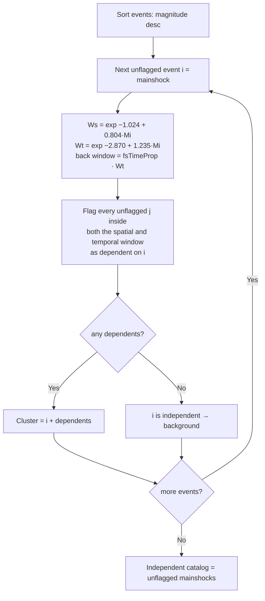

# Uhrhammer (1986)

> Part of [Declustering Methods](../declustering-methods.md). Algorithm: `uhrhammer` (Worker-routed).

Uses the **same window-declustering engine** as [Gardner-Knopoff](gardner-knopoff.md) (largest-first, both-windows test, haversine distances) but with Uhrhammer's exponential window definitions, which give generally **shorter, more conservative** windows — fewer events are removed as dependent.

## Windows

An event of magnitude $M$ defines the spatial radius $W_s(M)$ and temporal window $W_t(M)$:

$$
W_s(M) = \exp\!\bigl(-1.024 + 0.804\,M\bigr)\quad[\mathrm{km}],
\qquad
W_t(M) = \exp\!\bigl(-2.870 + 1.235\,M\bigr)\quad[\mathrm{days}].
$$

A smaller event $j$ is flagged **dependent** on a larger event $i$ when

$$
d_{ij}\le W_s(M_i)
\qquad\text{and}\qquad
-f\,W_t(M_i)\le t_j - t_i \le W_t(M_i),
$$

with $d_{ij}$ the haversine distance and $f=\texttt{uhrFsTimeProp}\in[0,1]$ the foreshock look-back fraction (default $f=1$, symmetric). Set $f<1$ to weight aftershocks more heavily than foreshocks. These exponential windows are shorter than Gardner-Knopoff's for typical magnitudes, so Uhrhammer removes fewer events as dependent.

## How it works

## Parameters

| Key | Default | Description |
|---|---|---|
| `uhrSpatialA` | −1.024 | Spatial $\exp(a+bM)$: $a$ |
| `uhrSpatialB` | 0.804 | Spatial $\exp(a+bM)$: $b$ |
| `uhrTemporalA` | −2.870 | Temporal $\exp(a+bM)$: $a$ |
| `uhrTemporalB` | 1.235 | Temporal $\exp(a+bM)$: $b$ |
| `uhrFsTimeProp` | 1.0 | Foreshock look-back as a fraction of $W_t$, in $[0,1]$ |

## References

- Uhrhammer, R. A. (1986). Characteristics of northern and central California seismicity (abstract). *Earthquake Notes*, **57**(1), 21.
- van Stiphout, T., Zhuang, J., & Marsan, D. (2012). Seismicity declustering. *Community Online Resource for Statistical Seismicity Analysis (CORSSA)*. https://doi.org/10.5078/corssa-52382934 — source of the tabulated Uhrhammer window coefficients.
