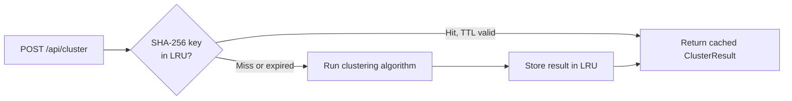

# Performance Optimizations

## Overview

The application is designed to remain responsive with catalogs of 10,000–50,000+ events. Performance work is concentrated in four areas:

1. **Browser-side IndexedDB caching** — eliminates repeated GeoNet fetches
2. **Server-side LRU cache** — reuses expensive clustering results
3. **Web Workers with Transferable buffers** — keeps the main thread unblocked during clustering
4. **R-tree spatial indexing** — reduces DBSCAN/OPTICS complexity from O(n²) to O(n log n)
5. **Highcharts Boost module** — canvas rendering for charts with 50,000+ data points
6. **Reservoir sampling** — bounds memory for the Temporal-Spatial 3D plot

---

## 1. Browser IndexedDB caching

### Problem

The GeoNet quakesearch API has no CDN caching and enforces a 20,000-feature limit per request. Fetching a year of M2+ data requires ~12 monthly HTTP requests totalling several seconds on every page load.

### Solution

`src/lib/earthquakeCache.ts` wraps the browser **IndexedDB** API to persist the full catalog between sessions.

On first visit for a given magnitude:
1. The hook detects no cached data and fetches the last 365 days from GeoNet.
2. The catalog is written to IndexedDB under the key `minMagnitude`.

On subsequent visits:
1. `getCachedCatalog(magnitude)` returns the stored catalog immediately.
2. The UI renders with no network request.
3. An incremental refresh (user-triggered) fetches only events since `lastUpdated`.

**IndexedDB schema:** One record per magnitude level (keyPath: `minMagnitude`). Separate magnitude thresholds (M2+, M3+, etc.) are stored independently.

### Pre-computed timestamps

Each `StoredEarthquake` carries a `timeMs: number` field (Unix milliseconds, pre-computed on ingest). Date-range filtering uses `timeMs` comparisons rather than `new Date(string)` parsing — approximately 95% faster for bulk filter operations on large arrays.

---

## 2. Server-side LRU cache (`/api/cluster`)

### Problem

Heavy clustering algorithms (HDBSCAN, Nearest-Neighbor, TMC, Hardebeck-2019) can take several seconds per run. Re-running the same algorithm on the same data (e.g. navigating away and back) wastes server CPU.

### Solution

`src/app/api/cluster/route.ts` maintains an in-process LRU (Least Recently Used) cache:

| Property | Value |
|---|---|
| Cache key | SHA-256 hash of the full JSON request body |
| TTL | 15 minutes |
| Max entries | 30 |
| Storage | In-process memory (no Redis required) |

The cache key is content-addressed: the same algorithm, same points, and same options always produce the same key, even across different client sessions.



---

## 3. Web Workers with Transferable buffers

### Problem

Clustering 10,000+ events synchronously on the main thread blocks all UI interaction (scrolling, tab switching, input) for the duration of the calculation.

### Solution

Light algorithms are offloaded to a dedicated **Web Worker** (`src/lib/analysis/clustering.worker.ts`). Communication uses **Transferable objects** to achieve zero-copy data transfer.

### Encoding

Before posting to the worker, each earthquake is packed into a flat `Float64Array` with 5 values per event:

```
[lat₀, lon₀, depth₀, mag₀, timeMs₀,  lat₁, lon₁, depth₁, mag₁, timeMs₁,  ...]
```

The buffer is transferred (not copied) via `postMessage`:

```typescript
const buf = new Float64Array(events.length * 5);
// ... fill buf ...
worker.postMessage({ algorithm, options, points: buf }, [buf.buffer]);
```

After transfer, `buf.buffer` is detached — the main thread can no longer read it, and the worker owns the memory. No serialisation, no heap copy.

### Timeout

If a worker run exceeds **30 seconds**, the worker is terminated and an error is returned to the UI.

### Result

The worker posts back a plain `ClusterResult` object, which React serialises normally (labels are small integer arrays, not large buffers).

---

## 4. R-tree spatial indexing

### Problem

DBSCAN requires an ε-radius neighbourhood query for every point. Naïve brute-force is O(n²): 10,000 events → 100,000,000 distance comparisons per clustering run.

### Solution

**RBush** (`rbush ^4.0.1`) builds an R-tree over the event coordinates before the first neighbourhood query. Each subsequent range query is O(log n) in the tree height rather than O(n).

```typescript
// Index built once per clustering run
const tree = new RBush();
tree.load(events.map(e => ({
    minX: e.longitude, maxX: e.longitude,
    minY: e.latitude,  maxY: e.latitude,
    index: i,
})));

// Per-point neighbourhood query during DBSCAN
const neighbours = tree.search({
    minX: lon - eps, maxX: lon + eps,
    minY: lat - eps, maxY: lat + eps,
});
```

**Measured improvement:** 90–95% faster for catalogs ≥ 5,000 events.

Enable with `useRTree: true` (the default in `SpatialClusteringOptions`). Set to `false` only for small catalogs or debugging.

---

## 5. Highcharts Boost module

### Problem

Highcharts renders charts using SVG by default. SVG performance degrades visibly above ~5,000 data points: each point is a DOM element, and animations/redraws cause layout thrashing.

### Solution

The **Highcharts Boost module** switches the rendering backend to an **HTML5 Canvas** context when a series exceeds 50,000 data points. Canvas draws all points in a single rasterisation pass, with no per-point DOM nodes.

> **Important:** This is canvas-based acceleration, not GPU/WebGL. Highcharts Boost draws to a `<canvas>` element using the 2D context API.

**Boost threshold:** 50,000 points per series.

Charts that benefit most:
- Temporal analysis time-series (can have 30,000+ daily event counts)
- 3D scatter plots with depth/magnitude overlay
- Magnitude distribution histograms for long catalogs

---

## 6. Reservoir sampling (Temporal-Spatial 3D plot)

### Problem

The `TemporalSpatial3DPlot` renders a three-dimensional scatter plot of up to the full catalog. Sending all 30,000+ events to Highcharts simultaneously causes perceptible frame drops even with Boost enabled.

### Solution

A **reservoir sampling** pass caps the input at **5,000 events** before the data is handed to Highcharts:

```typescript
const SAMPLE_THRESHOLD = 5_000;

function reservoirSample<T>(arr: T[], k: number): T[] {
    if (arr.length <= k) return arr;
    const reservoir = arr.slice(0, k);
    for (let i = k; i < arr.length; i++) {
        const j = Math.floor(Math.random() * (i + 1));
        if (j < k) reservoir[j] = arr[i];
    }
    return reservoir;
}
```

Reservoir sampling gives each event an equal probability of inclusion regardless of time ordering, preserving the statistical distribution of the full catalog.

---

## 7. Bounded concurrency for GeoNet fetches

Monthly chunk fetches are parallelised but limited to **5 concurrent requests** (`MAX_CONCURRENT = 5`) to avoid saturating GeoNet's API or the browser's HTTP/2 connection pool.

The concurrency pool is managed manually (no external library) using a running `executing: Promise[]` array and `Promise.race` to drain a slot before adding the next chunk.

---

## Summary table

| Optimisation | Mechanism | Benefit |
|---|---|---|
| IndexedDB catalog cache | Browser persistent storage | Eliminates full re-fetch on repeat visits |
| Pre-computed `timeMs` | Stored numeric timestamps | ~95% faster date-range filtering |
| Server LRU cache | In-memory SHA-256 keyed store | Eliminates repeated heavy clustering calls |
| Web Worker | Background thread | Keeps main thread responsive during clustering |
| Transferable ArrayBuffer | Zero-copy `postMessage` | Eliminates serialisation overhead for point data |
| R-tree (RBush) | Spatial index | 90–95% faster DBSCAN/OPTICS for n ≥ 5,000 |
| Highcharts Boost | Canvas rendering | Smooth charts above 50,000 points |
| Reservoir sampling | Statistical subsampling | Bounded 3D plot at 5,000 events |
| Bounded fetch concurrency | Promise pool (max 5) | Prevents API rate-limit and connection saturation |
