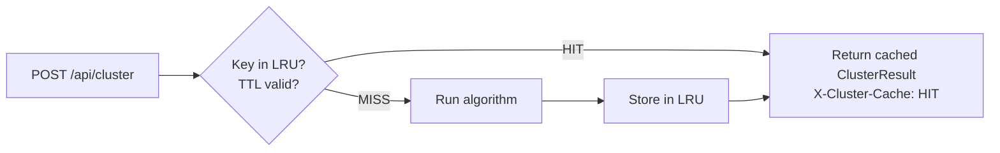

# Performance Optimizations

The application targets smooth interaction with catalogs of 10,000–50,000+ events across six complementary optimisation strategies.

---

## 1. Browser IndexedDB catalog cache

### Problem

GeoNet's quakesearch API has no CDN caching and enforces a 20,000-feature limit per request. Fetching a year of M2+ data requires ~12 monthly HTTP requests totalling several seconds — on every page load if no caching exists.

### Solution

`src/lib/earthquakeCache.ts` wraps the browser **IndexedDB** API to persist the full catalog across sessions.

- **Schema:** `esnz-earthquake-catalog` (v1), object store `catalogs`, keyPath `minMagnitude`
- **One record per magnitude threshold:** M2+, M3+, M4+ are stored independently
- **First visit:** fetches 365 days, saves to IndexedDB
- **Subsequent visits:** `getCachedCatalog(magnitude)` returns immediately, no network request
- **Refresh:** incremental fetch from `lastUpdated` to now; only new events downloaded

### Pre-computed `timeMs`

Every `StoredEarthquake` stores a `timeMs: number` field — Unix milliseconds pre-computed at ingest time. Date-range filtering compares `timeMs` numerically rather than parsing ISO strings with `new Date()`. This is approximately **95% faster** for bulk filter operations on 20,000+ event arrays.

### IndexedDB availability guard

`earthquakeCache.ts` handles all known failure modes:

- **SSR / no window:** early-bail with `Promise.reject` + no-op `.catch()` to prevent unhandled rejection warnings
- **Synchronous throw from `indexedDB.open()`:** caught inside the Promise constructor (Safari Private Browsing, Chrome strict storage block)
- **`request.onerror`:** resets `dbPromise = null` so the next call retries
- **`request.onblocked`:** logs a warning (another tab has an older schema version open)

When IndexedDB is unavailable, the catalog is fetched from GeoNet on every page load without error.

---

## 2. Server-side LRU cache for clustering

### Problem

Heavy algorithms (HDBSCAN, Nearest-Neighbor, TMC, Hardebeck-2019) running on 20,000+ events can take several seconds per invocation. Re-running with identical inputs is pure waste.

### Solution

`/api/cluster/route.ts` maintains an **in-process LRU cache**:

| Property | Value |
|---|---|
| Cache key | SHA-256(sorted event IDs + algorithm + serialised params).slice(0, 16) |
| TTL | 15 minutes |
| Max entries | 30 |
| Eviction | Oldest entry removed on overflow |
| Response header | `X-Cluster-Cache: HIT` or `MISS` |

The key is content-addressed: same algorithm + same events + same options always produce the same key regardless of client session.



> **Serverless note:** This cache is in-process. It resets on Vercel cold starts (scale-to-zero). Within a warm function instance it works across all requests.

---

## 3. Client-side clustering result cache

A **second, separate cache** in `src/lib/analysis/clusteringCache.ts` prevents re-running algorithms in the Web Worker when the user toggles unrelated UI controls:

| Property | Value |
|---|---|
| Max entries | 10 |
| TTL | 5 minutes |
| Key | `dataHash : JSON.stringify(options)` |

**Data hash (O(1) — does not iterate all events):**

```typescript
hash = `${events.length}:${events[0].timeMs}:${events[mid].timeMs}:${events[last].timeMs}:${sample_magnitudes}`
```

Sampling avoids O(n) hashing while still detecting changes to the dataset.

---

## 4. Web Workers with Transferable buffers

### Problem

Clustering 10,000+ events synchronously on the main thread blocks all UI interaction for the duration of the calculation — scrolling, tab switching, and input all freeze.

### Solution

Light algorithms run in **`clustering.worker.ts`**, a dedicated Web Worker:

1. **Encoding:** each earthquake is packed into a flat `Float64Array` with 5 values per event:
   ```
   [lat, lon, depth, mag, timeMs,  lat, lon, depth, mag, timeMs,  ...]
   ```
2. **Zero-copy transfer:**
   ```typescript
   worker.postMessage({ buf, n: events.length, options, requestId }, [buf.buffer]);
   ```
   After transfer, `buf.buffer` is detached in the main thread — no heap copy, no serialisation.
3. **Timeout:** if the worker takes > **30 seconds**, it is terminated and an error is returned to the UI.
4. **Result:** the worker posts back a plain `ClusterResult` object (labels are small integer arrays, not large buffers — standard structured-clone is fine for the response).

The worker also accepts a legacy format `{ earthquakes: EarthquakeData[], options }` for callers that do not use the packed format.

> **No SharedArrayBuffer:** communication uses Transferable `ArrayBuffer` (one-way ownership transfer), not SharedArrayBuffer. SharedArrayBuffer requires `Cross-Origin-Opener-Policy` headers; Transferable needs no special configuration.

---

## 5. R-tree spatial indexing

### Problem

DBSCAN and similar algorithms must perform an ε-radius neighbourhood query for every point. Brute-force is O(n²): 10,000 events → 100,000,000 distance comparisons.

### Solution

**RBush** (`rbush ^4.0.1`) builds an R-tree spatial index over projected (x, y) coordinates before the first query. Each range query is O(log n):

```typescript
const tree = new RBush();
tree.load(events.map((e, i) => ({
    minX: x[i], maxX: x[i],
    minY: y[i], maxY: y[i],
    index: i,
})));

// Per-point query during DBSCAN core-point test
const candidates = tree.search({
    minX: x[p] - epsilon, maxX: x[p] + epsilon,
    minY: y[p] - epsilon, maxY: y[p] + epsilon,
});
```

Candidates are then distance-filtered exactly (the R-tree returns a bounding-box superset).

**Measured improvement: 90–95% faster** for catalogs ≥ 5,000 events.

Enabled via `useRTree: true` (the default). Set to `false` only for very small catalogs or debugging.

---

## 6. Highcharts Boost module (canvas rendering)

### Problem

Highcharts renders charts using SVG by default. SVG degrades visibly above ~5,000 data points — each point is a DOM element; redraws cause layout thrashing.

### Solution

The **Highcharts Boost module** switches the rendering backend to an **HTML5 Canvas 2D context** when a series exceeds **50,000 data points**. All points are rasterised in a single canvas pass with no per-point DOM nodes.

> **This is canvas-based acceleration, not GPU/WebGL.** Highcharts Boost uses the `<canvas>` 2D context API — hardware-accelerated compositing happens at the OS level as a side effect of canvas compositing, but the drawing itself is CPU-driven.

Charts that benefit most:
- Temporal analysis time-series (can exceed 30,000 daily-count points for long catalogs)
- Magnitude distribution histograms
- 3D scatter plots with depth and magnitude overlays

---

## 7. Reservoir sampling

### Problem

The `TemporalSpatial3DPlot` renders a three-dimensional scatter plot. Sending 30,000+ events to Highcharts simultaneously causes perceptible frame drops even with Boost enabled.

### Solution

**Knuth reservoir sampling** caps the input at **5,000 events** (`TEMPORAL_SPATIAL_SAMPLE_SIZE`) before rendering:

```typescript
const reservoir = arr.slice(0, k);                      // fill reservoir
for (let i = k; i < arr.length; i++) {
    const j = Math.floor(Math.random() * (i + 1));      // random index 0..i
    if (j < k) reservoir[j] = arr[i];                   // replace with probability k/(i+1)
}
```

Every event has equal probability `k/n` of being in the final sample, preserving the statistical distribution of the full catalog regardless of time ordering.

---

## 8. Bounded concurrency for GeoNet fetches

Monthly chunks are parallelised with a manual concurrency pool capped at **`MAX_CONCURRENT = 5`**:

```typescript
const executing: Promise<void>[] = [];
for (let i = 0; i < chunks.length; i++) {
    const p = fetchChunkRecursive(chunks[i], ...)
        .then(result => { ... })
        .finally(() => { executing.splice(executing.indexOf(p), 1); });

    executing.push(p);
    if (executing.length >= MAX_CONCURRENT) {
        await Promise.race(executing);   // wait for one slot to free
    }
}
await Promise.all(executing);
```

This prevents saturating GeoNet's API and avoids exhausting the browser's HTTP/2 connection pool (browsers allow 6 simultaneous connections per origin).

---

## 9. Memoisation and debouncing

- **`filteredEarthquakes`** in `PageClient.tsx` is a `useMemo` that only recomputes when `earthquakes`, `filters`, or date parameters change
- **`Statistics`** component is wrapped in `React.memo` to prevent re-renders when unrelated state changes
- **Clustering slider changes** in `TemporalSpatial.tsx` use a **600 ms debounce** — the algorithm does not re-run until the user stops adjusting a slider
- **`CacheIndicator`** age display auto-refreshes via `setInterval` every 60 seconds without triggering a catalog reload

---

## Summary

| Optimisation | Mechanism | Measured benefit |
|---|---|---|
| IndexedDB catalog cache | Browser persistent storage | Eliminates full re-fetch on repeat visits |
| Pre-computed `timeMs` | Stored numeric timestamps | ~95% faster date-range filtering |
| Server LRU cache | SHA-256 keyed in-process store (30 entries, 15 min) | Eliminates repeated heavy clustering runs |
| Client clustering cache | O(1)-hashed in-memory store (10 entries, 5 min) | Prevents redundant Worker calls for same input |
| Web Worker | Background thread + 30s timeout | Main thread stays responsive during clustering |
| Transferable ArrayBuffer | Zero-copy `postMessage` | No serialisation overhead for point data |
| R-tree (RBush) | Spatial index for range queries | 90–95% faster DBSCAN/OPTICS for n ≥ 5,000 |
| Highcharts Boost | Canvas rendering above 50k points | Smooth charts for large catalogs |
| Reservoir sampling | Knuth's algorithm at 5,000 events | Bounded 3D plot memory and render time |
| Bounded fetch concurrency | Promise pool, max 5 | Prevents GeoNet rate-limit and connection saturation |
| Slider debounce | 600 ms delay before re-clustering | Eliminates mid-drag recalculations |

---

## Configuration reference

Performance knobs live in `src/config/performance.ts`. The **live** keys and their environment overrides:

| Key | Default | Env override | Effect |
|---|---|---|---|
| `CLUSTERING.ENABLE_WEB_WORKERS` | `true` | `NEXT_PUBLIC_ENABLE_WEB_WORKERS` | Route light clustering to a Web Worker |
| `CLUSTERING.USE_RTREE` | `true` | `NEXT_PUBLIC_USE_RTREE` | R-tree acceleration for DBSCAN/ST-DBSCAN |
| `CACHE.MEMORY_TTL` | `60000` ms | `NEXT_PUBLIC_CACHE_TTL_MS` | In-memory cache TTL |
| `HIGHCHARTS.BOOST_THRESHOLD` | `50000` | — | Canvas-mode Boost cut-in |
| `TEMPORAL_SPATIAL_SAMPLE_SIZE` | `5000` | — | Reservoir cap before clustering |
| `MONITORING.ENABLED` | `NODE_ENV==='development'` | — | Enable the performance monitor |

### Per-chart display sampling

Several views down-sample purely for rendering (the analysis still uses the full set). `getOptimalSamplingThreshold()` multiplies these by **device tier** — ×2 on high-memory/many-core devices, ×0.5 on low-end:

| Chart | Trigger → target |
|---|---|
| Map, Depth Profile, Temporal | 50,000 → 25,000 |
| 3D Visualization | 20,000 → 15,000 |
| Temporal-Spatial clustering | reservoir at 5,000 |

### Deployment (`vercel.json`)

Region `syd1`; serverless `maxDuration` 120 s for `api/**` (the `/api/cluster` route additionally exports a 60 s limit, which governs it); CDN header `Cache-Control: s-maxage=60, stale-while-revalidate=300` on `/api/*`.

### Monitoring

`src/lib/monitoring/` provides an optional, **development-only** layer (surfaced via `PerformanceDebugPanel`):

- **`PerformanceMonitor`** — `track`/`trackAsync` timings with p50/p95/p99 stats, a 1,000 ms slow-operation warning, a 1,000-metric ring buffer, and JSON export.
- **`ErrorTracker`** — severity-tagged error capture with optional `window.Sentry` forwarding (no callers wired by default).

### Stale / unused config keys

These exist in `performance.ts` but are **not wired to any behaviour** — do not treat them as live: `FETCH.*` (the fetch window is hardcoded to 365 days in `useGeoNetData`), `CACHE.DISK_PATH` / `ENABLE_COALESCING` (no server disk cache exists), `CLUSTERING.WEB_WORKER_THRESHOLD` (routing is by algorithm class, not dataset size), and `MAX_CLUSTERING_SIZE`.
