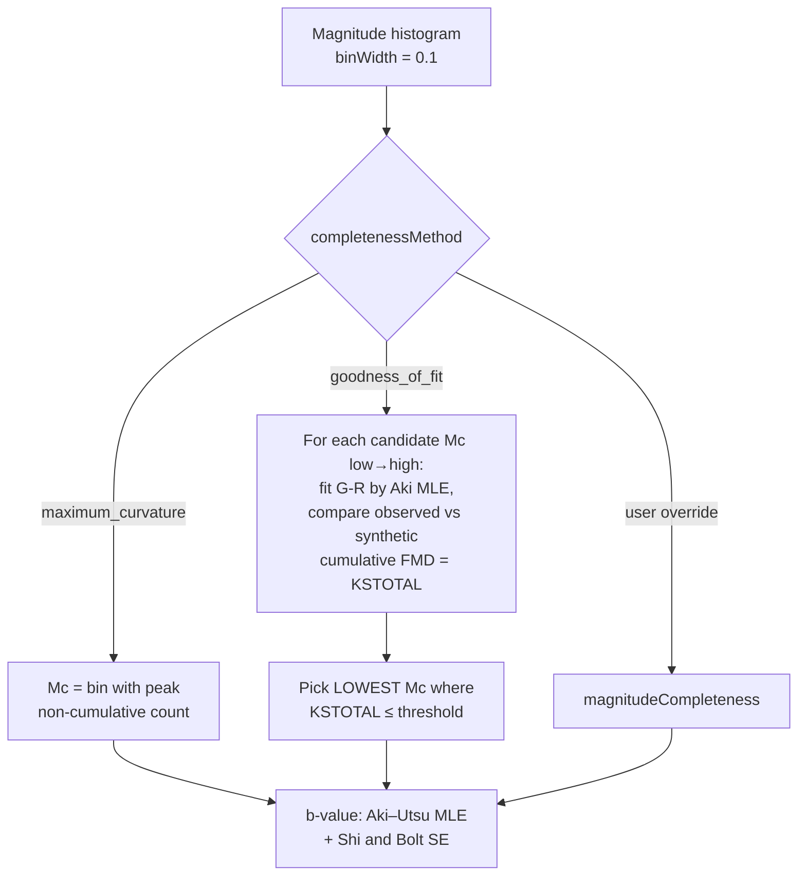

# Statistical Models

## Omori–Utsu Law

### Formula

The modified Omori–Utsu law describes the temporal decay of aftershock rate after a mainshock:

$$\lambda(t) = \frac{K}{(t + c)^{p}}$$

| Symbol | Meaning | Typical range |
|---|---|---|
| $\lambda(t)$ | Aftershock rate at time $t$ days after the mainshock | — |
| $K$ | Productivity constant | $> 0$ |
| $c$ | Time offset (days) — prevents singularity at $t = 0$ | $0.001$–$2.0$ |
| $p$ | Decay exponent | $0.7$–$1.6$ (tectonic), typically $\approx 1.0$ |

### Cumulative aftershock count

Integrating the rate function gives the expected cumulative count up to time $T$:

$$N(T) = \frac{K}{1-p}\left[(T+c)^{1-p} - c^{1-p}\right], \qquad p \neq 1$$

$$N(T) = K\ln\!\left(\frac{T + c}{c}\right), \qquad p = 1$$

---

### Seven optimisation methods

| ID | Method | Description |
|---|---|---|
| `grid-search` | Exhaustive grid | $p \in [0.8, 1.5]$ step $0.1$; $c \in [0.01, 1.0]$ step $0.1$. $K$ solved analytically (see below). ~210 evaluations. |
| `levenberg-marquardt` | LM least-squares | Grid-search initialised, then LM refinement via `ml-levenberg-marquardt`. Bounds: $K \in [0.001, 10^6]$, $c \in [0.001, 10]$, $p \in [0.5, 2.0]$. 100 max iterations. |
| `nelder-mead` | Simplex | Derivative-free. Strict bounds: $K \in [1, K_{\max}]$, $c \in [0.01, 2.0]$, $p \in [0.7, 1.6]$. Soft penalties for $c > 0.5$ and $|p - 1.1| > 0.3$. 200 max iterations. |
| `hybrid` | Grid + LM | Grid-search initialisation followed by LM refinement. Selects best $R^2$ result. **Recommended starting method.** |
| `mle` | Maximum Likelihood | Maximises log-likelihood over observed interevent times (not binned counts). Nelder-Mead optimisation, 300 max iterations. |
| `mle-sa` | MLE + Simulated Annealing | MLE with simulated-annealing global search. Temperature $T_0 = 1.0$, cooling $\alpha = 0.995$. Allows uphill moves to escape local minima. 5,000 max iterations. |
| `mle-em` | MLE + EM | Expectation-Maximisation. E-step: compute normalised rates as weights. M-step: update $p$ and $c$ via gradient; $K$ analytically. 200 max iterations. |

### Analytical solution for $K$

For fixed $p$ and $c$, $K$ is solved in closed form by minimising the sum of squared residuals:

$$K = \frac{\displaystyle\sum_{i} \frac{n_i}{(t_i + c)^{p}}}{\displaystyle\sum_{i} \frac{1}{(t_i + c)^{2p}}}$$

where $n_i$ is the observed count in the $i$-th time bin centred at $t_i$.

### MLE log-likelihood

The point-process log-likelihood for event times $\{t_1, \ldots, t_N\}$ observed in $[t_0, T]$ is:

$$\ln \mathcal{L} = \sum_{i=1}^{N} \ln \lambda(t_i) - \int_{t_0}^{T} \lambda(t)\,\mathrm{d}t$$

$$= \sum_{i=1}^{N} \bigl[\ln K - p\ln(t_i + c)\bigr] - \frac{K}{1-p}\left[(T+c)^{1-p} - (t_0+c)^{1-p}\right], \qquad p \neq 1$$

The integral's **lower bound is $t_0 = \texttt{OMORI\_T\_START\_DAYS} = 0.001$ d** (≈ 1.4 minutes), not 0 — it must match the start of the observation window used when binning the aftershock series. Integrating from 0 instead biased the fitted parameters and confidence intervals (corrected across all MLE integrals and the profile-likelihood grid). The adaptive initial estimate for $p$ uses the ratio of early-period to late-period event rates.

---

### OmoriParameters — full structure

```typescript
interface OmoriParameters {
    K: number;
    c: number;
    p: number;
    rSquared: number;

    dailyCounts:              { day: number; count: number }[];
    fittedCounts:             { day: number; count: number }[];
    cumulativeCounts:         { day: number; count: number }[];
    expectedCumulativeCounts: { day: number; count: number }[];

    qqPlotData:             { x: number; y: number }[];
    residualProcess:        { t: number; residual: number }[];
    standardizedResiduals:  { day: number; residual: number;
                              observed: number; expected: number }[];
    profileLikelihood:      { p: number; c: number; logLikelihood: number }[];

    optimizationMethod?: OptimizationMethod;
    iterations?:         number;
    uncertainty?:        ParameterUncertainty;
}
```

---

### Confidence intervals

Two methods are available:

#### Hessian-based (default — 40–100× faster than bootstrap)

Uses the **Fisher Information Matrix** via finite-difference approximation of the Hessian of the log-likelihood at the MLE estimate $\hat{\boldsymbol{\theta}} = (\hat{K}, \hat{c}, \hat{p})$:

$$\boldsymbol{\Sigma} = \sigma^2 \, \mathbf{H}^{-1} / 2, \qquad \sigma^2 = \frac{\mathrm{SSE}}{n - 3}$$

Standard errors and 95% confidence intervals:

$$\mathrm{SE}_j = \sqrt{\Sigma_{jj}}, \qquad \mathrm{CI}_{95\%}(\theta_j) = \hat{\theta}_j \pm 1.96\,\mathrm{SE}_j$$

#### Bootstrap (100 resamplings)

1. Resample the aftershock catalogue 100 times with replacement
2. Refit Omori parameters for each resample
3. Filter outliers via the IQR method
4. 95% CI: 2.5th and 97.5th percentiles of the filtered distribution

#### ParameterUncertainty structure

```typescript
interface ParameterUncertainty {
    K_se?: number;  c_se?: number;  p_se?: number;
    K_ci?: [number, number];   // 95% CI
    c_ci?: [number, number];
    p_ci?: [number, number];
    logLikelihood?: number;
    aic?: number;   // -2 ln L + 2k,  k = 3
    bic?: number;   // -2 ln L + k ln n
}
```

Information criteria ($k = 3$ parameters):

$$\mathrm{AIC} = -2\ln\mathcal{L} + 2k, \qquad \mathrm{BIC} = -2\ln\mathcal{L} + k\ln n$$

---

### Model diagnostics

#### Q-Q plot (inter-event times)

If the Omori model is correct, the transformed process should produce i.i.d. $\mathrm{Exp}(1)$ inter-arrivals. The cumulative intensity (compensator) transforms each observed event time:

$$\tau_i = \Lambda(t_i) = \int_0^{t_i} \lambda(t)\,\mathrm{d}t$$

The transformed inter-arrivals $\Delta\tau_i = \tau_i - \tau_{i-1}$ should be $\mathrm{Exp}(1)$. The Q-Q plot compares their empirical quantiles against the theoretical quantile:

$$Q_{\mathrm{theoretical}}(i) = -\ln\!\left(1 - \frac{i - 0.5}{n}\right)$$

Deviation from the 45° diagonal indicates model misfit.

#### Cumulative residual process

The cumulative residual at each observed event time measures departures from the expected count:

$$R(t_i) = i - \Lambda(t_i)$$

A flat process indicates good fit; a systematic trend indicates under- or over-prediction in that time interval.

#### Standardised Pearson residuals

Per daily bin $j$:

$$r_j = \frac{O_j - E_j}{\sqrt{E_j}}$$

Values outside $\pm 2$ indicate poor fit for that interval.

#### Profile likelihood surface

The profile log-likelihood is computed over a grid of $p \in [0.5, 1.8]$ (step $0.1$) and $c \in [0.01, 1.0]$ (step $0.1$), with $K$ optimised analytically at each node (~140 grid points). The surface reveals parameter correlations and whether the MLE is at a global maximum.

---

### Historical NZ earthquake presets

| Event | Date | Magnitude |
|---|---|---|
| Kaikōura | 2016-11-14 | M7.8 |
| Christchurch | 2011-02-22 | M6.3 |
| Canterbury (Darfield) | 2010-09-04 | M7.1 |
| Seddon | 2013-07-21 | M6.5 |
| Cook Strait | 2013-07-21 | M6.6 |
| Eketāhuna | 2014-01-20 | M6.3 |
| Fiordland | 2009-07-15 | M7.8 |
| Gisborne | 2007-12-20 | M6.7 |
| Dunedin | 2021-05-06 | M5.8 |
| Arthur's Pass | 1994-06-18 | M6.7 |
| Weber | 1990-02-13 | M6.3 |
| Hawke's Bay | 1931-02-03 | M7.8 |

Any event can be analysed via custom mainshock input (datetime, magnitude, optional lat/lon).

---

### Reference models

Pre-configured aftershock sequence parameters from the literature, shown as overlay curves on the Omori fit plot. The expected rate from a reference model is:

$$K = 10^{\,a + b(M_m - M_c)}, \qquad \lambda(t) = \frac{K}{(t + c)^{p}}$$

| Model | Region | $a$ | $b$ | $p$ | $c$ (days) |
|---|---|---|---|---|---|
| Reasenberg & Jones (1989) | Generic California | $-1.67$ | $0.91$ | $1.08$ | $0.050$ |
| Hardebeck et al. (2019) | Southern California | $-2.30$ | $1.0$ | $0.83$ | $0.0033$ |
| Hardebeck et al. (2019) | Northern California | $-2.64$ | $1.0$ | $0.96$ | $0.012$ |
| Hardebeck et al. (2019) | Mendocino zone | $-3.18$ | $1.0$ | $1.15$ | $0.050$ |
| Hardebeck et al. (2019) | Hydrothermal | $-1.79$ | $1.0$ | $0.94$ | $0.026$ |

---

### PDF report generation

The **Generate Report** button captures all five chart `<div>` elements via `html2canvas`, assembles a multi-page PDF with `jsPDF`, and embeds: mainshock parameters, fitted $K$, $c$, $p$, uncertainty intervals, AIC, BIC, optimisation method, and declustering method used.

---

## Gutenberg-Richter Analysis

### Frequency-magnitude relation

$$\log_{10} N(M) = a - bM$$

| Symbol | Meaning |
|---|---|
| $N(M)$ | Cumulative number of earthquakes with magnitude $\geq M$ |
| $a$ | Activity parameter — $\log_{10}$ of total events at $M = 0$ |
| $b$ | b-value (slope); typically $0.8$–$1.2$ for tectonic settings |

### Magnitude of completeness $M_c$



**Maximum Curvature (`maximum_curvature`, default):** $M_c$ is the magnitude at the peak of the non-cumulative frequency-magnitude histogram. Fast and widely used; may underestimate $M_c$ in heterogeneous catalogs.

**Goodness of Fit — Wiemer & Wyss (2000), KSTOTAL (`goodness_of_fit`):** Iterates over candidate $M_c$ from low to high. For each candidate it fits a G-R model by the Aki MLE and measures **KSTOTAL** — the mean absolute difference between the observed cumulative FMD and the synthetic FMD predicted by that fit, normalised by the number of events at or above $M_c$. It selects the **lowest** $M_c$ at which KSTOTAL drops below the acceptance threshold. (Selecting the maximum-$R^2$ candidate is biased toward the smallest $M_c$, so the KSTOTAL drop-below-threshold rule is used instead.)

### b-value estimation

The b-value uses the **Aki (1965) / Utsu maximum-likelihood estimator**, not OLS regression:

$$b = \frac{\log_{10} e}{\bar{M} - \left(M_c - \tfrac{1}{2}\,\Delta M\right)}, \qquad a = \log_{10} N(\!\geq\! M_c) + b\,M_c$$

where $\bar{M}$ is the mean magnitude of events $\geq M_c$ and $\Delta M$ is the bin width (the $\Delta M/2$ term is the binning correction). The standard error on $b$ follows **Shi & Bolt (1982)**:

$$\sigma_b = 2.30\,b^2\sqrt{\frac{\sum_i (M_i - \bar{M})^2}{N(N-1)}}$$

$R^2$ of the fitted line vs the cumulative counts is reported alongside as a descriptive goodness measure.

### GutenbergRichterResult

```typescript
interface GutenbergRichterResult {
    bValue:                    number;
    bUncertainty:              number;   // Shi & Bolt (1982) standard error on b
    aValue:                    number;
    magnitudeOfCompleteness:   number;   // Mc
    rSquared:                  number;
    earthquakesAboveMc:        number;
    binCenters:                number[];  // magnitude bin centres
    cumulativeCounts:          number[];  // N(≥M) per bin
    fittedLine:                number[];  // predicted counts from GR fit
}
```

Default bin width: $0.1$ magnitude units (configurable via `binWidth` option).

---

## What is NOT implemented

| Feature | Status |
|---|---|
| Gardner-Knopoff declustering | **Implemented** — as a window-declustering clustering algorithm (`gardner-knopoff`) in the Temporal-Spatial tab, and as a window definition in the Aftershock Sequence tab. See [Clustering Algorithms](clustering-algorithms.md#gardner-knopoff-1974). |
| Uhrhammer declustering | **Implemented** — `uhrhammer` clustering algorithm (shares the Gardner-Knopoff window-declustering core). |
| ETAS (Epidemic-Type Aftershock Sequence) | Not implemented |
| Hawkes process fitting | Not implemented |
| Hierarchical clustering (single/complete/average/Ward) | Removed — was listed in README but code was deleted |
